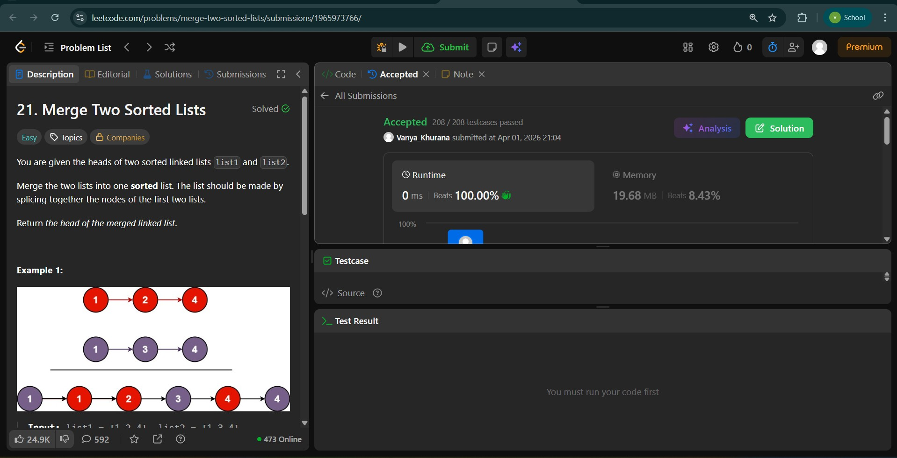
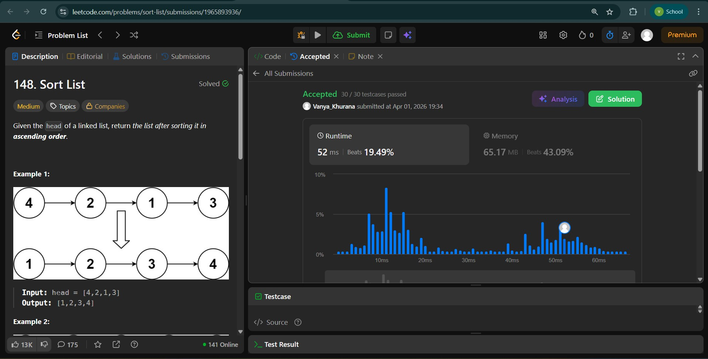
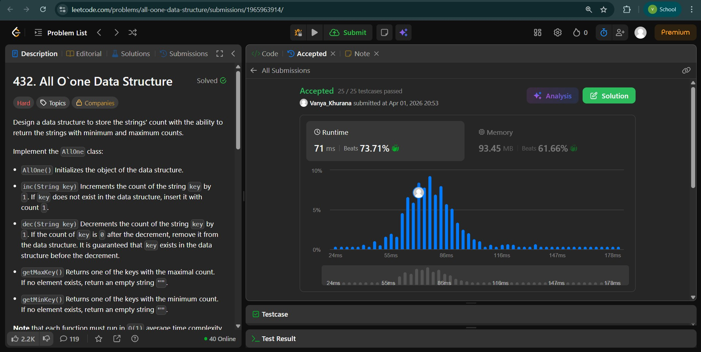

# Day - 10
## Beginner Level 


```cpp
lass Solution {
public:
    ListNode* mergeTwoLists(ListNode* list1, ListNode* list2) {
        ListNode*dummy = new ListNode(0);
        ListNode*temp = dummy;
        while (list1 != NULL and list2 != NULL){
            if (list1->val < list2->val){
                dummy->next = new ListNode(list1->val);
                list1 = list1->next;
                dummy = dummy->next;
            }
            else if(list1->val > list2->val){
                dummy->next = new ListNode(list2->val);
                list2 = list2->next;
                dummy = dummy->next;
            }
            else{
                dummy->next = new ListNode(list1->val);
                dummy->next->next = new ListNode(list2->val);
                list1 = list1->next;
                list2 = list2->next;
                dummy = dummy->next->next;
            }
        }
        while (list2) {
            dummy->next = new ListNode(list2->val);
            list2 = list2->next;
            dummy = dummy->next;
        }
        while (list1) {
            dummy->next = new ListNode(list1->val);
            list1 = list1->next;
            dummy = dummy->next;
        }
        dummy->next = NULL;
        return temp->next;
    }
};
```

### Output


## Intermediate Level


```cpp
class Solution {
public:
    ListNode* sortList(ListNode* head) {
        priority_queue<int,vector<int>,greater<int>>pq;
        ListNode*temp = head;
        while(temp != NULL){
            pq.push(temp->val);
            temp = temp->next;
        }
        ListNode*newList = new ListNode(0);
        ListNode*dummy = newList;
        while(!pq.empty()){
            int value = pq.top();
            pq.pop();
            dummy->next = new ListNode(value);
            dummy = dummy->next;
        }
        dummy->next = NULL;
        return newList->next;
    }
};
```

### Output


## Advanced Level


```cpp
class Node{
public:
    int count;
    unordered_set<string>keys;
    Node*prev;
    Node*next;
    Node(int c){
        count = c;
        prev = next = NULL;   // count + set of keys with that count
    }
};
class AllOne {
public:
    unordered_map<string , Node*>mp;
    Node*head;
    Node*tail;
    AllOne() {
        head = NULL;
        tail = NULL;
    }
    void insertAfter(Node*curr , Node*newNode){
        newNode->next = curr->next;
        newNode->prev = curr;
        if (curr->next) curr->next->prev = newNode;
        curr->next = newNode;

        if (tail == curr) tail = newNode;
    }
    void insertAtHead(Node*node){
        if(!head){
            head = tail = node;
        }
        else{
            node->next = head;
            head->prev = node;
            head = node;
        }
    }
    void removeNode(Node*node){
        if (node->prev) node->prev->next = node->next;
        else head = node->next;

        if (node->next) node->next->prev = node->prev;
        else tail = node->prev;

        delete node;
    }
    void inc(string key) {
        if (mp.find(key) == mp.end()){
            // new key -> count = 1
            if(!head or head->count != 1){
                Node*node = new Node(1);
                insertAtHead(node);
            }
            head->keys.insert(key);
            mp[key] = head;
        }
        else{
            Node*curr = mp[key];
            int newCount = curr->count + 1;

            curr->keys.erase(key);
            Node*nextNode = curr->next;
            if (!nextNode or nextNode->count != newCount){
                Node*node = new Node(newCount);
                insertAfter(curr , node);
                nextNode = node;
            } 
            nextNode->keys.insert(key);
            mp[key] = nextNode;
            if (curr->keys.empty()){
                removeNode(curr);
            }
        }
    }
    
    void dec(string key) {
        Node*curr = mp[key];
        int newCount = curr->count - 1;
        curr->keys.erase(key);

        if (newCount == 0){
            mp.erase(key);
        }
        else{
            Node*prevNode = curr->prev;
            if (!prevNode or prevNode->count != newCount){
                Node*node = new Node(newCount);

                if (curr->prev) insertAfter(curr->prev , node);
                else insertAtHead(node);

                prevNode = node;
            }
            prevNode->keys.insert(key);
            mp[key] = prevNode;
        }
        if (curr->keys.empty()) {
            removeNode(curr);
        }
    }
    
    string getMaxKey() {
        if (!tail) return "";
        return *(tail->keys.begin());
    }
    
    string getMinKey() {
        if (!head) return "";
        return *(head->keys.begin());
    }
};
```

### Output

