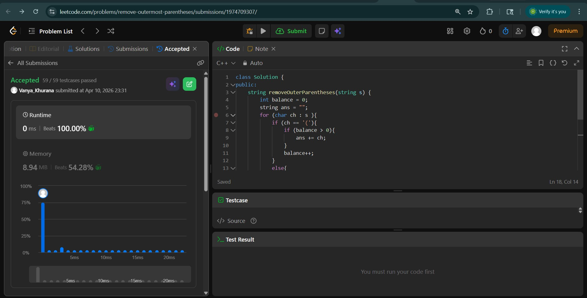
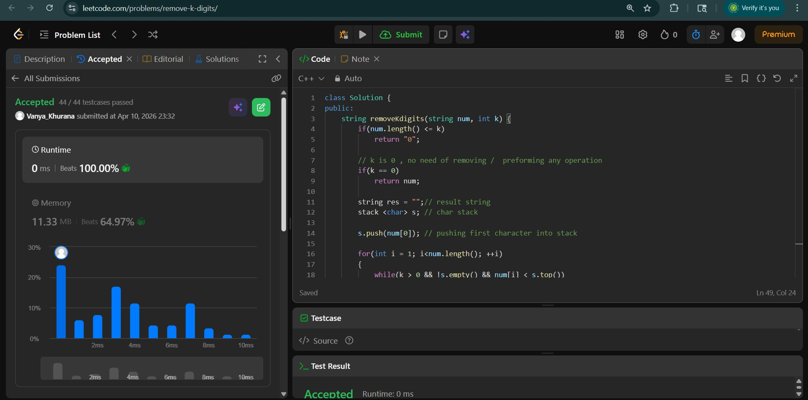
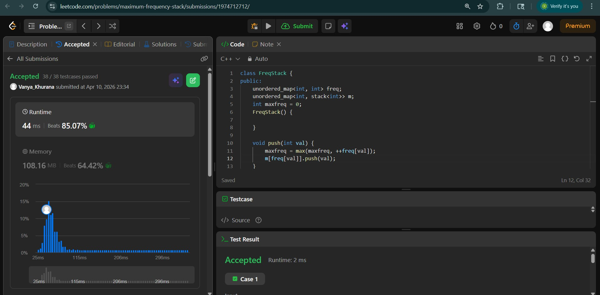

# Day - 20
## Beginner Level 


```cpp
class Solution {
public:
    string removeOuterParentheses(string s) {
        int balance = 0;
        string ans = "";
        for (char ch : s ){
            if (ch == '('){
                if (balance > 0){
                    ans += ch;
                }
                balance++;
            }
            else{
                if (balance > 1){
                    ans += ch;
                }
                balance--;
            }
        }
        return ans; 
   }
};
```

### Output


## Intermediate Level


```cpp
class Solution {
public:
    string removeKdigits(string num, int k) {
        if(num.length() <= k)   
            return "0";
        
        // k is 0 , no need of removing /  preforming any operation
        if(k == 0)
            return num;
        
        string res = "";// result string
        stack <char> s; // char stack
        
        s.push(num[0]); // pushing first character into stack
        
        for(int i = 1; i<num.length(); ++i)
        {
            while(k > 0 && !s.empty() && num[i] < s.top())
            {
                // if k greater than 0 and our stack is not empty and the upcoming digit,
                // is less than the current top than we will pop the stack top
                --k;
                s.pop();
            }
            
            s.push(num[i]);
            
            // popping preceding zeroes
            if(s.size() == 1 && num[i] == '0')
                s.pop();
        }
        
        while(k && !s.empty())
        {
            // for cases like "456" where every num[i] > num.top()
            --k;
            s.pop();
        }
        
        while(!s.empty())
        {
            res.push_back(s.top()); // pushing stack top to string
            s.pop(); // pop the top element
        }
        
        reverse(res.begin(),res.end()); // reverse the string 
        
        if(res.length() == 0)
            return "0";
        
        return res;
        
    }
};
```

### Output


## Advanced Level


```cpp
class FreqStack {
public:
    unordered_map<int, int> freq;
    unordered_map<int, stack<int>> m;
    int maxfreq = 0;
    FreqStack() {
        
    }
    
    void push(int val) {
        maxfreq = max(maxfreq, ++freq[val]);
        m[freq[val]].push(val);
    }
    
    int pop() {
        int x = m[maxfreq].top();
        m[maxfreq].pop();
        if (!m[freq[x]--].size()) maxfreq--;
        return x;
    }
};

```

### Output

