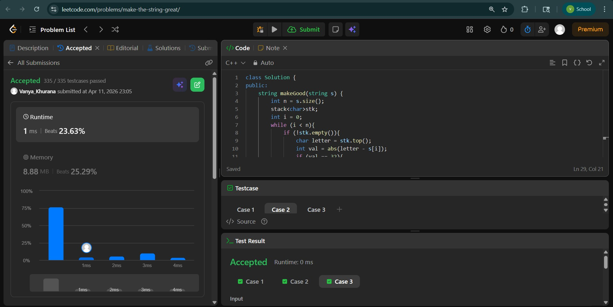
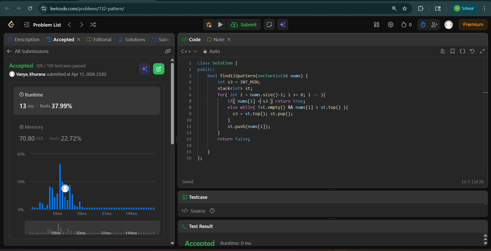
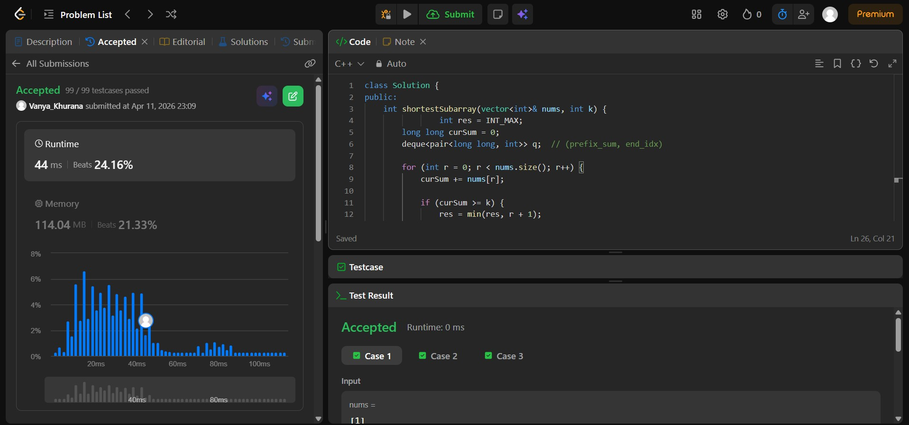

# Day - 21
## Beginner Level 


```cpp
class Solution {
public:
    string makeGood(string s) {
        int n = s.size();
        stack<char>stk;
        int i = 0;
        while (i < n){
            if (!stk.empty()){
                char letter = stk.top();
                int val = abs(letter - s[i]);
                if (val == 32){
                    stk.pop();
                }
                else if (val != 32){
                    stk.push(s[i]);
                }
                i++;
            }
            else{
                stk.push(s[i]);
                i++;
            }
        }
        string ans = "";
        while (!stk.empty()){
            ans += stk.top();
            stk.pop();
        }
        reverse(ans.begin() , ans.end());
        return ans;
    }
};
```

### Output


## Intermediate Level


```cpp
class Solution {
public:
    bool find132pattern(vector<int>& nums) {
        int s3 = INT_MIN;
        stack<int> st;
        for( int i = nums.size()-1; i >= 0; i -- ){
            if( nums[i] < s3 ) return true;
            else while( !st.empty() && nums[i] > st.top() ){ 
              s3 = st.top(); st.pop(); 
            }
            st.push(nums[i]);
        }
        return false;

    }
};
```

### Output


## Advanced Level


```cpp
class Solution {
public:
    int shortestSubarray(vector<int>& nums, int k) {
                int res = INT_MAX;
        long long curSum = 0;
        deque<pair<long long, int>> q;  // (prefix_sum, end_idx)
        
        for (int r = 0; r < nums.size(); r++) {
            curSum += nums[r];
            
            if (curSum >= k) {
                res = min(res, r + 1);
            }
            
            // Find the minimum valid window ending at r
            while (!q.empty() && curSum - q.front().first >= k) {
                auto [prefix, endIdx] = q.front();
                q.pop_front();
                res = min(res, r - endIdx);
            }
            
            // Validate the monotonic deque
            while (!q.empty() && q.back().first > curSum) {
                q.pop_back();
            }
            q.push_back({curSum, r});
        }
        
        return res == INT_MAX ? -1 : res;
    }
};
```

### Output

