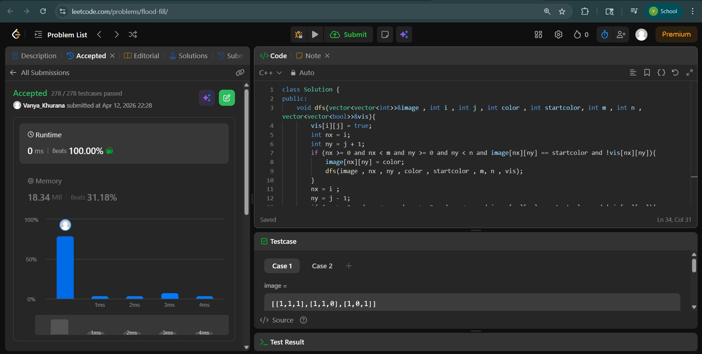
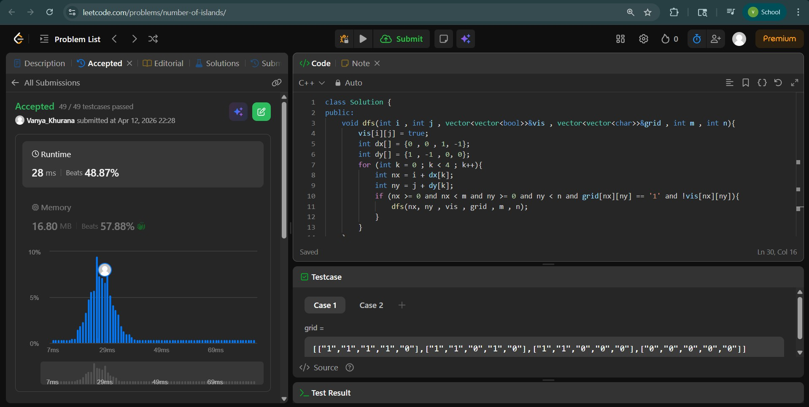
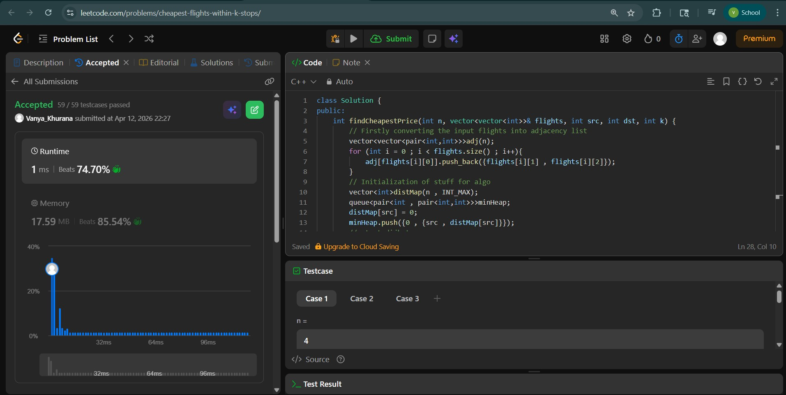

# Day - 22
## Beginner Level 


```cpp
class Solution {
public:
    void dfs(vector<vector<int>>&image , int i , int j , int color , int startcolor, int m , int n , vector<vector<bool>>&vis){
        vis[i][j] = true;
        int nx = i;
        int ny = j + 1;
        if (nx >= 0 and nx < m and ny >= 0 and ny < n and image[nx][ny] == startcolor and !vis[nx][ny]){
            image[nx][ny] = color;
            dfs(image , nx , ny , color , startcolor , m, n , vis);
        }
        nx = i ;
        ny = j - 1;
        if (nx >= 0 and nx < m and ny >= 0 and ny < n and image[nx][ny] == startcolor and !vis[nx][ny]){
            image[nx][ny] = color;
            dfs(image , nx , ny , color , startcolor , m, n, vis);
        }
        nx = i + 1;
        ny = j;
        if (nx >= 0 and nx < m and ny >= 0 and ny < n and image[nx][ny] == startcolor and !vis[nx][ny]){
            image[nx][ny] = color;
            dfs(image , nx , ny , color , startcolor , m, n , vis);
        }
        nx = i - 1;
        ny = j;
        if (nx >= 0 and nx < m and ny >= 0 and ny < n and image[nx][ny] == startcolor and !vis[nx][ny]){
            image[nx][ny] = color;
            dfs(image , nx , ny , color , startcolor , m, n , vis);
        }
    }
    vector<vector<int>> floodFill(vector<vector<int>>& image, int sr, int sc, int color) {
        int startcolor = image[sr][sc];
        int m = image.size();
        int n = image[0].size();
        image[sr][sc] = color;
        vector<vector<bool>> vis(m , vector<bool>(n ,false));
        dfs(image , sr , sc , color , startcolor , m , n , vis);
        return image;
    }
};
```

### Output


## Intermediate Level


```cpp
class Solution {
public:
    void dfs(int i , int j , vector<vector<bool>>&vis , vector<vector<char>>&grid , int m , int n){
        vis[i][j] = true;
        int dx[] = {0 , 0 , 1, -1};
        int dy[] = {1 , -1 , 0, 0};
        for (int k = 0 ; k < 4 ; k++){
            int nx = i + dx[k];
            int ny = j + dy[k];
            if (nx >= 0 and nx < m and ny >= 0 and ny < n and grid[nx][ny] == '1' and !vis[nx][ny]){
                dfs(nx, ny , vis , grid , m , n);
            }
        }
    }
    int numIslands(vector<vector<char>>& grid) {
        int m = grid.size();
        int n = grid[0].size();
        int cnt = 0;
        vector<vector<bool>>vis(m , vector<bool>(n , false));
        for (int i = 0 ; i < m ; i++){
            for (int j = 0 ; j < n ; j++){
                if (grid[i][j] == '1'){
                    if (!vis[i][j]){
                        dfs(i,j,vis,grid,m,n);
                        cnt++;
                    }
                }
            }
        }
        return cnt;
    }
};
```

### Output


## Advanced Level


```cpp
class Solution {
public:
    int findCheapestPrice(int n, vector<vector<int>>& flights, int src, int dst, int k) {
        // Firstly converting the input flights into adjacency list
        vector<vector<pair<int,int>>>adj(n);
        for (int i = 0 ; i < flights.size() ; i++){
            adj[flights[i][0]].push_back({flights[i][1] , flights[i][2]});
        }
        // Initialization of stuff for algo
        vector<int>distMap(n , INT_MAX);
        queue<pair<int , pair<int,int>>>minHeap;
        distMap[src] = 0;
        minHeap.push({0 , {src , distMap[src]}});  
        // start dijkstra
        while (!minHeap.empty()){
            auto it = minHeap.front();
            minHeap.pop();
            int stops = it.first;
            int cur = it.second.first;
            int cost = it.second.second;
            if (stops > k) continue; // base case if k condition is not met
            for (auto [ngb , dist] : adj[cur]){
                if (cost + dist < distMap[ngb] and stops <= k){
                    distMap[ngb] = dist + cost;   // update the map
                    minHeap.push({1 + stops , {ngb , distMap[ngb]}}); // push to th queue for next iteration 
                }
            }
        }
        if (distMap[dst] == INT_MAX) return -1;
        return distMap[dst];
    }
};
```

### Output

