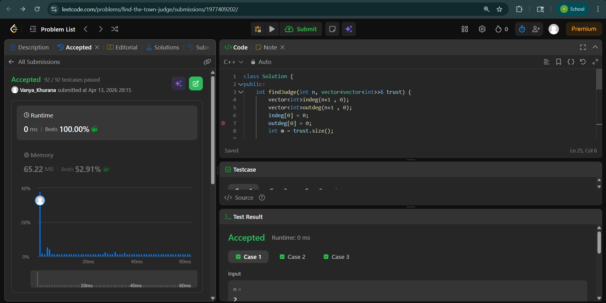
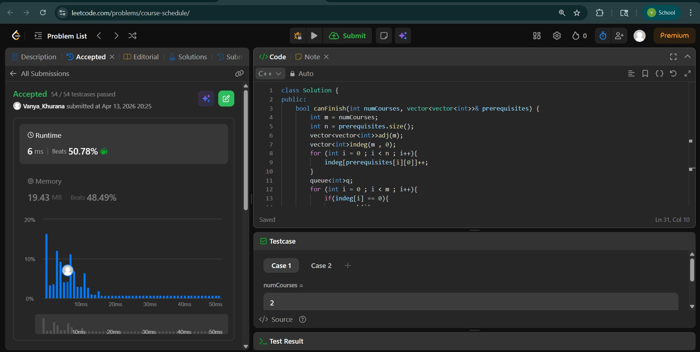
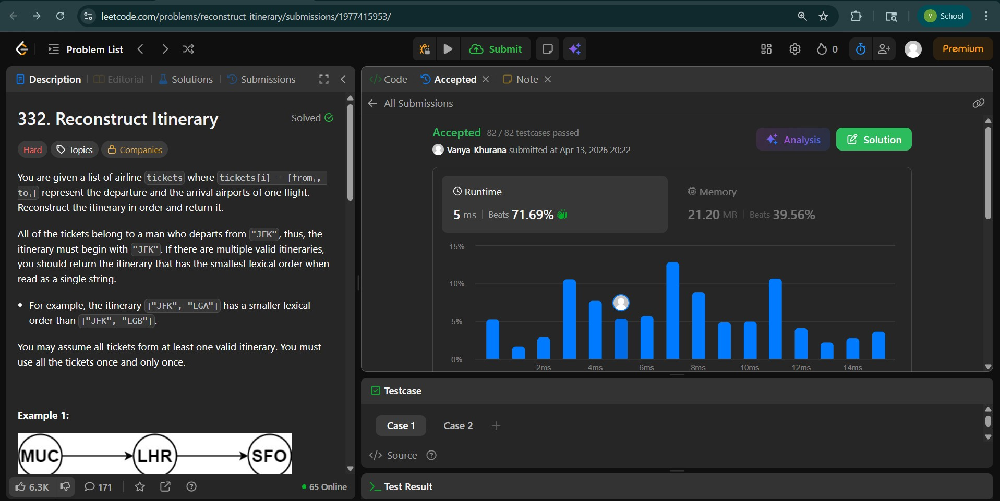

# Day - 23
## Beginner Level 


```cpp
class Solution {
public:
    int findJudge(int n, vector<vector<int>>& trust) {
        vector<int>indeg(n+1 , 0);
        vector<int>outdeg(n+1 , 0);
        indeg[0] = 0;
        outdeg[0] = 0;
        int m = trust.size();

        /*for (int i = 1 ; i <= n ; i++){
            indeg[trust[i][1]]++;
            outdeg[trust[i][0]]++;
        }*/
        for (int i = 0 ; i < m ; i++){
            indeg[trust[i][1]]++;
            outdeg[trust[i][0]]++;
        }
        int ans = -1;
        for (int i = 1 ; i <= n ; i++){
            if (indeg[i] == n-1 and outdeg[i] == 0){
                ans = i;
            }
        }
        return ans;
    }
};
```

### Output


## Intermediate Level


```cpp
class Solution {
public:
    bool canFinish(int numCourses, vector<vector<int>>& prerequisites) {
        int m = numCourses;
        int n = prerequisites.size();
        vector<vector<int>>adj(m);
        vector<int>indeg(m , 0);
        for (int i = 0 ; i < n ; i++){
            indeg[prerequisites[i][0]]++;
        }
        queue<int>q;
        for (int i = 0 ; i < m ; i++){
            if(indeg[i] == 0){
                q.push(i);
            }
        }
        for (int i = 0; i < n ; i++){
            adj[prerequisites[i][1]].push_back(prerequisites[i][0]);
        }
        vector<int> ans;
        while (!q.empty()){
            int cur = q.front();
            q.pop();
            ans.push_back(cur);
            for (int ngb : adj[cur]){
                indeg[ngb]--;
                if(indeg[ngb] == 0){
                    q.push(ngb);
                }
            }
        }
        if (ans.size() == m){
            return true;
        }
        else{
            return false;
        }
    }
};
```

### Output


## Advanced Level


```cpp
class Solution {
public:
    vector<string> findItinerary(vector<vector<string>>& tickets) {
        unordered_map<string, vector<string>> graph;
        
        for (auto& ticket : tickets) {
            graph[ticket[0]].push_back(ticket[1]);
        }
        
        for (auto& [_, destinations] : graph) {
            sort(destinations.rbegin(), destinations.rend());
        }
        
        vector<string> itinerary;
        
        function<void(const string&)> dfs = [&](const string& airport) {
            while (!graph[airport].empty()) {
                string next = graph[airport].back();
                graph[airport].pop_back();
                dfs(next);
            }
            itinerary.push_back(airport);
        };
        
        dfs("JFK");
        reverse(itinerary.begin(), itinerary.end());
        
        return itinerary;
    }
};
```

### Output

