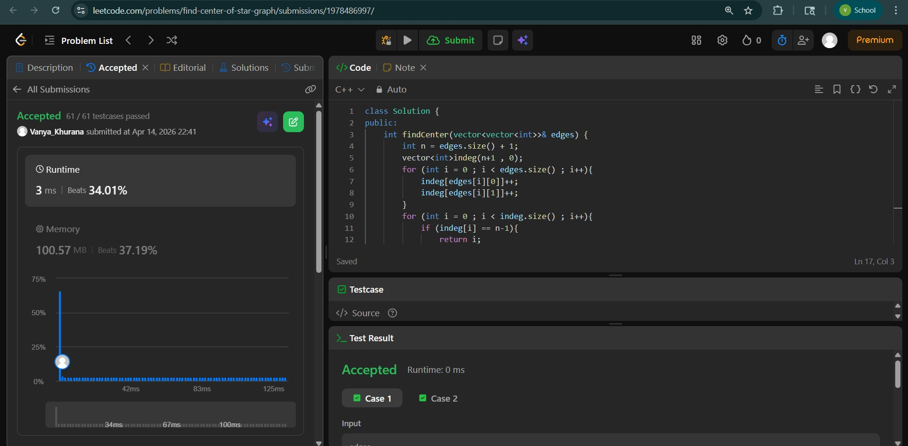
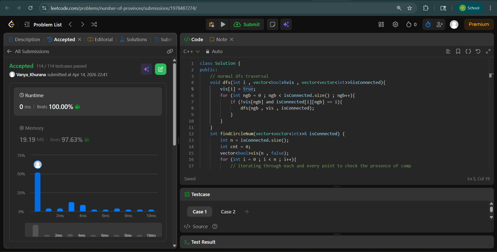
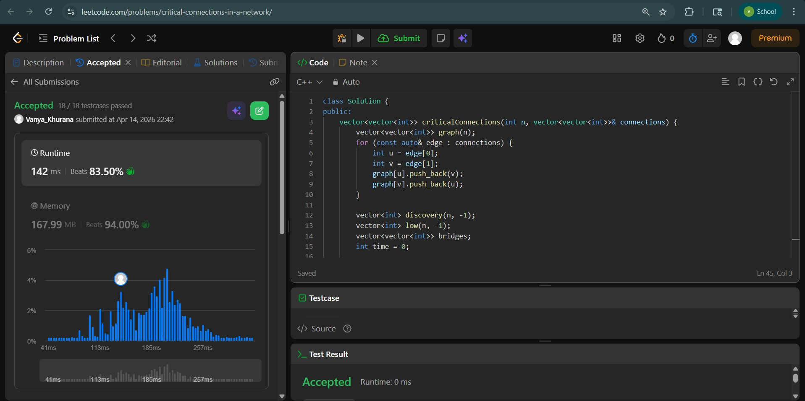

# Day - 24
## Beginner Level 


```cpp
class Solution {
public:
    int findCenter(vector<vector<int>>& edges) {
        int n = edges.size() + 1;
        vector<int>indeg(n+1 , 0);
        for (int i = 0 ; i < edges.size() ; i++){
            indeg[edges[i][0]]++;
            indeg[edges[i][1]]++;
        }
        for (int i = 0 ; i < indeg.size() ; i++){
            if (indeg[i] == n-1){
                return i;
            }
        }
        return -1;
    }
};
```

### Output


## Intermediate Level


```cpp
class Solution {
public:
    // normal dfs traversal 
    void dfs(int i , vector<bool>&vis , vector<vector<int>>&isConnected){
        vis[i] = true;
        for (int ngb = 0 ; ngb < isConnected.size() ; ngb++){
            if (!vis[ngb] and isConnected[i][ngb] == 1){
                dfs(ngb , vis , isConnected);
            }
        }
    }
    int findCircleNum(vector<vector<int>>& isConnected) {
        int n = isConnected.size();
        int cnt = 0;
        vector<bool>vis(n , false);
        for (int i = 0 ; i < n ; i++){
            // iterating through each and every point to check the presence of comp
            if (!vis[i] ){
                dfs(i , vis , isConnected);
                cnt++;
            }
        }
        return cnt;
    }
};
```

### Output


## Advanced Level


```cpp
class Solution {
public:
    vector<vector<int>> criticalConnections(int n, vector<vector<int>>& connections) {
        vector<vector<int>> graph(n);
        for (const auto& edge : connections) {
            int u = edge[0];
            int v = edge[1];
            graph[u].push_back(v);
            graph[v].push_back(u);
        }

        vector<int> discovery(n, -1);
        vector<int> low(n, -1);
        vector<vector<int>> bridges;
        int time = 0;

        function<void(int, int)> dfs = [&](int node, int parent) {
            discovery[node] = low[node] = time++;

            for (int neighbor : graph[node]) {
                if (neighbor == parent) continue;

                if (discovery[neighbor] == -1) {
                    dfs(neighbor, node);

                    low[node] = min(low[node], low[neighbor]);

                    if (low[neighbor] > discovery[node]) {
                        bridges.push_back({node, neighbor});
                    }
                } else {
                    low[node] = min(low[node], discovery[neighbor]);
                }
            }
        };

        for (int i = 0; i < n; ++i) {
            if (discovery[i] == -1) {
                dfs(i, -1);
            }
        }

        return bridges;
    }
};
```

### Output

