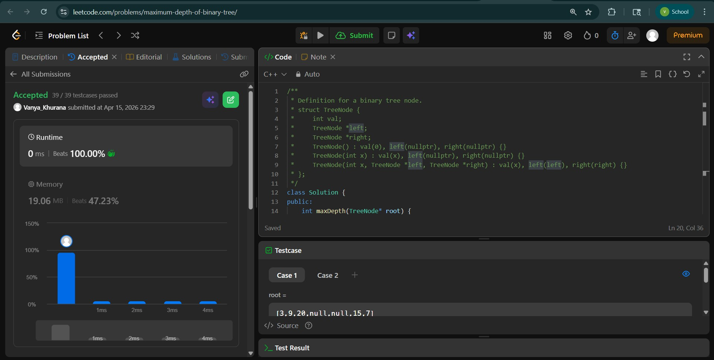
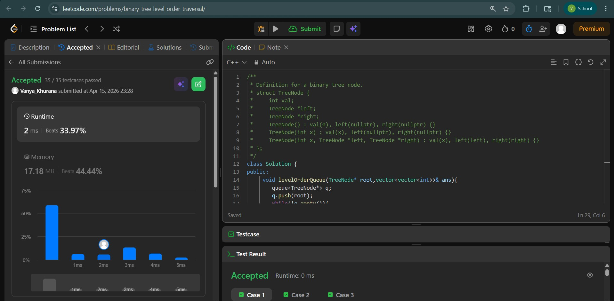
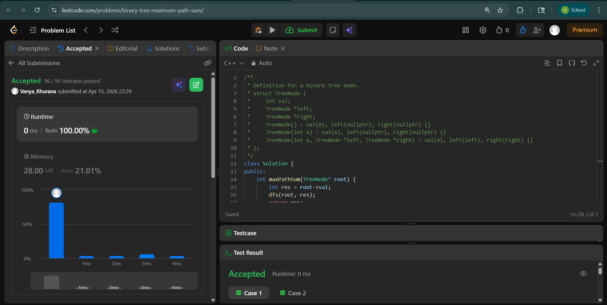

# Day - 25
## Beginner Level 


```cpp
class Solution {
public:
    int maxDepth(TreeNode* root) {
        // base case
        if (root == NULL){
            return 0;
        }
        // recursive case
        int hlst = maxDepth(root->left);
        int hrst = maxDepth(root->right);
        return 1 + max(hlst , hrst);
    }
};
```

### Output


## Intermediate Level


```cpp
class Solution {
public:
     void levelOrderQueue(TreeNode* root,vector<vector<int>>& ans){
        queue<TreeNode*> q;
        q.push(root);
        while(!q.empty()){
            int size=q.size();
            vector<int> v;
            for(int i=0;i<size;i++){
                TreeNode* temp=q.front();
                q.pop();
                v.push_back(temp->val);
                if(temp->left!=NULL) q.push(temp->left);
                if(temp->right!=NULL) q.push(temp->right);
            }
            ans.push_back(v);
        }
    }
    vector<vector<int>> levelOrder(TreeNode* root) {
        vector<vector<int>> ans;
        if(root==NULL) return ans;
        levelOrderQueue(root,ans);
        return ans;
    }
};
```

### Output


## Advanced Level


```cpp
class Solution {
public:
    int maxPathSum(TreeNode* root) {
        int res = root->val;
        dfs(root, res);
        return res;
    }
private:
    int dfs(TreeNode* node, int& res) {
        if (!node) {
            return 0;
        }

        // Recursively compute the maximum sum of the left and right subtree paths.
        int leftSum = max(0, dfs(node->left, res));
        int rightSum = max(0, dfs(node->right, res));

        // Update the maximum path sum encountered so far (with split).
        res = max(res, leftSum + rightSum + node->val);

        // Return the maximum sum of the path (without split).
        return max(leftSum, rightSum) + node->val;
    }
};
```

### Output

