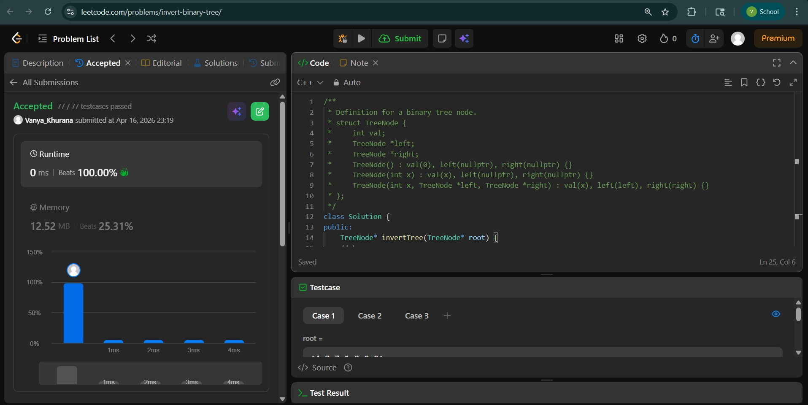
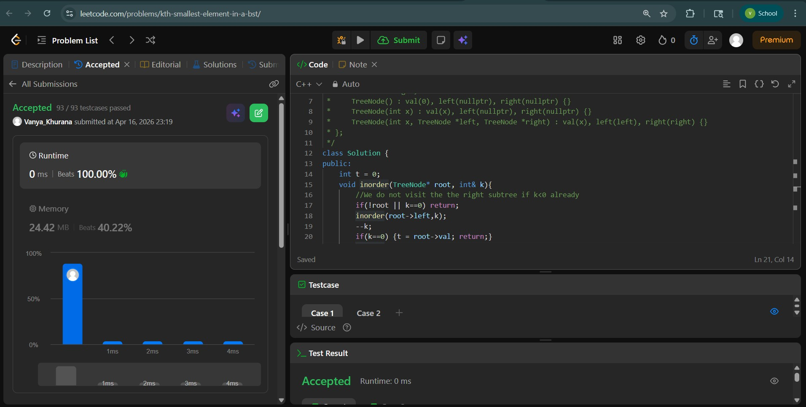
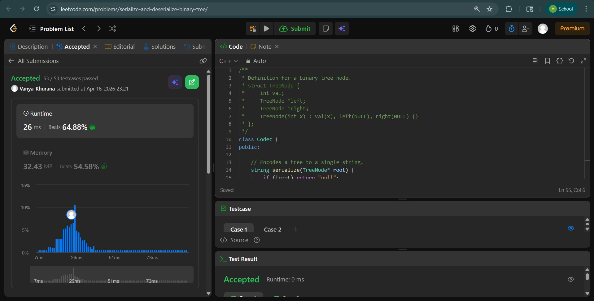

# Day - 26
## Beginner Level 


```cpp
class Solution {
public:
    TreeNode* invertTree(TreeNode* root) {
    // base case
    if (root == NULL){
        return NULL;
    }
    // recursive case
    TreeNode*LST = invertTree(root->left);
    TreeNode*RST = invertTree(root->right);
    root->right = LST;
    root->left = RST;
    return root;
    }
};
```

### Output


## Intermediate Level


```cpp
class Solution {
public:
    int t = 0;
    void inorder(TreeNode* root, int& k){
        //We do not visit the the right subtree if k<0 already
        if(!root || k==0) return;
        inorder(root->left,k);
        --k;
        if(k==0) {t = root->val; return;}
        inorder(root->right,k);

    }
    int kthSmallest(TreeNode* root, int k) {
        inorder(root,k);
        return t;
    }
};
```

### Output


## Advanced Level


```cpp
class Codec {
public:

    // Encodes a tree to a single string.
    string serialize(TreeNode* root) {
        if (!root) return "null";
        queue<TreeNode*> q;
        q.push(root);
        string res;
        while (!q.empty()) {
            TreeNode* node = q.front(); q.pop();
            if (node) {
                res += to_string(node->val) + ",";
                q.push(node->left);
                q.push(node->right);
            } else {
                res += "null,";
            }
        }
        return res;
    }

    // Decodes your encoded data to tree.
    TreeNode* deserialize(string data) {
        if (data == "null") return nullptr;
        stringstream ss(data);
        string token;
        getline(ss, token, ',');
        TreeNode* root = new TreeNode(stoi(token));
        queue<TreeNode*> q;
        q.push(root);
        while (!q.empty()) {
            TreeNode* node = q.front(); q.pop();
            if (!getline(ss, token, ',')) break;
            if (token != "null") {
                node->left = new TreeNode(stoi(token));
                q.push(node->left);
            }
            if (!getline(ss, token, ',')) break;
            if (token != "null") {
                node->right = new TreeNode(stoi(token));
                q.push(node->right);
            }
        }
        return root;
    }
};
```

### Output

