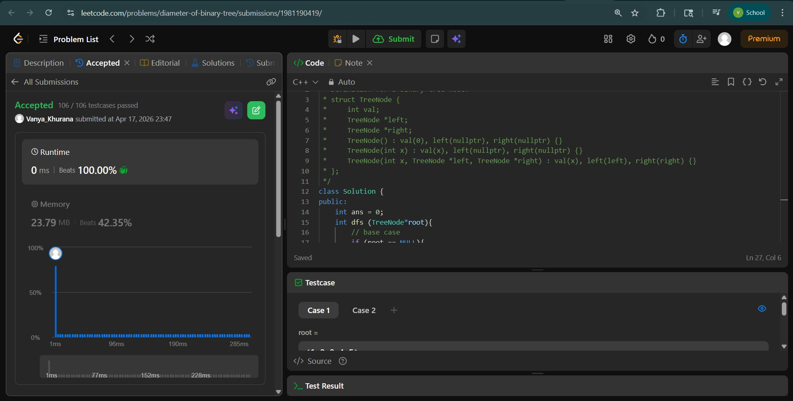
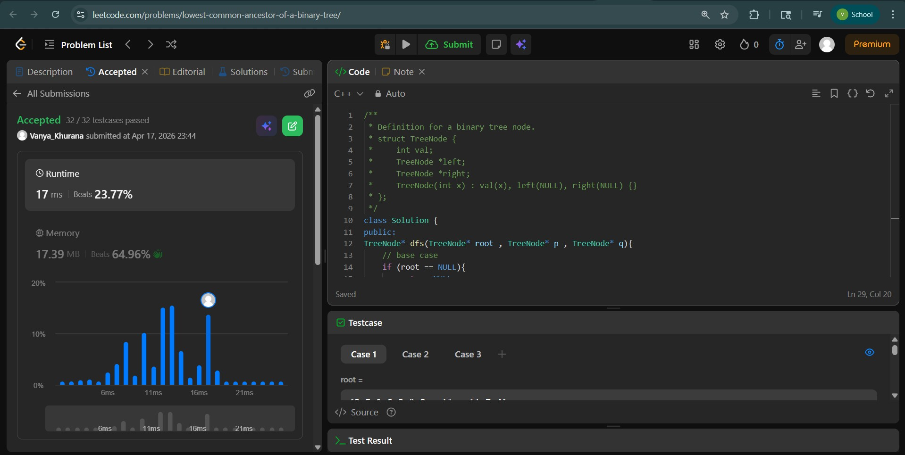
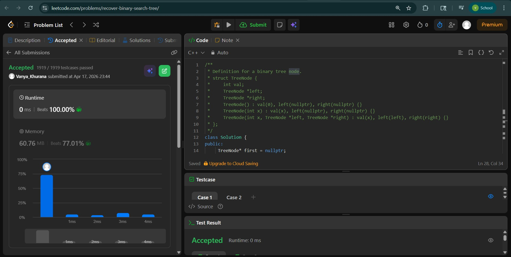

# Day - 27
## Beginner Level 


```cpp
class Solution {
public:
    int ans = 0;
    int dfs (TreeNode*root){
        // base case
        if (root == NULL){
            return -1;
        }
        // recursive case
        int leftHgt = dfs(root->left);
        int rightHgt = dfs(root->right);

        int lenOfLongest = leftHgt + rightHgt  + 2;
        ans = max(ans , lenOfLongest);
        return 1 + max(leftHgt , rightHgt);
    }
    int diameterOfBinaryTree(TreeNode* root) {
        dfs(root);
        return ans;
    }
};
```

### Output


## Intermediate Level


```cpp
class Solution {
public:
TreeNode* dfs(TreeNode* root , TreeNode* p , TreeNode* q){
    // base case
    if (root == NULL){
        return NULL;
    }
    if (root == p || root == q){
        return root;
    }
    // recursive case
    TreeNode* left = dfs(root->left , p ,q);
    TreeNode* right = dfs(root->right , p , q);
    if(left != NULL and right != NULL){
        return root;
    }
    else if (left != NULL){
        return left;
    }
    else if(right != NULL){
        return right;
    }else{
        return NULL;
    }
}
    TreeNode* lowestCommonAncestor(TreeNode* root, TreeNode* p, TreeNode* q) {
        return dfs(root , p ,q);
    }
};
```

### Output


## Advanced Level


```cpp
class Solution {
public:
     TreeNode* first = nullptr;
    TreeNode* second = nullptr;
    TreeNode* prev = nullptr;

    void recoverTree(TreeNode* root) {
        helper(root);
        // Swap the values of the two wrong nodes
        swap(first->val, second->val);
    }
    void helper(TreeNode* node) {
        if (!node) return;

        helper(node->left);

        if (prev && prev->val > node->val) {
            if (!first) first = prev;
            second = node;
        }

        prev = node;

        helper(node->right);
    }
};
```

### Output

