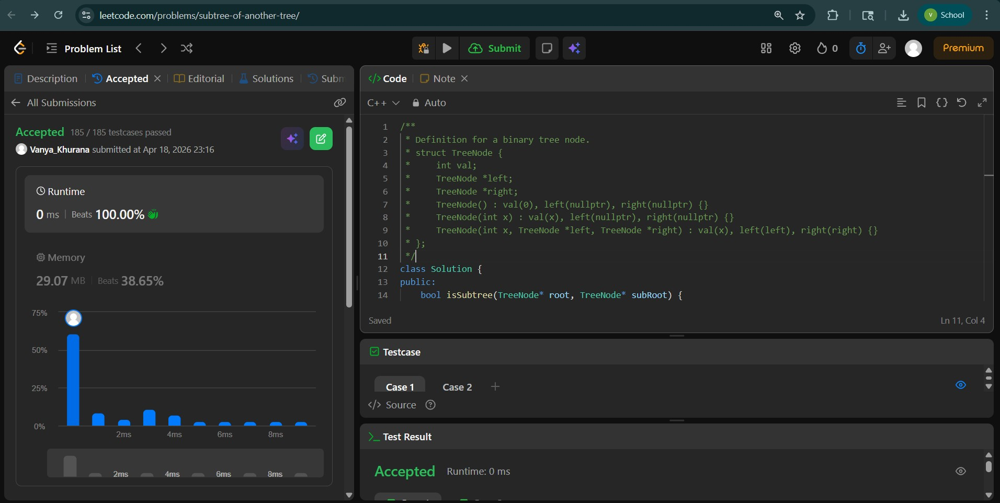
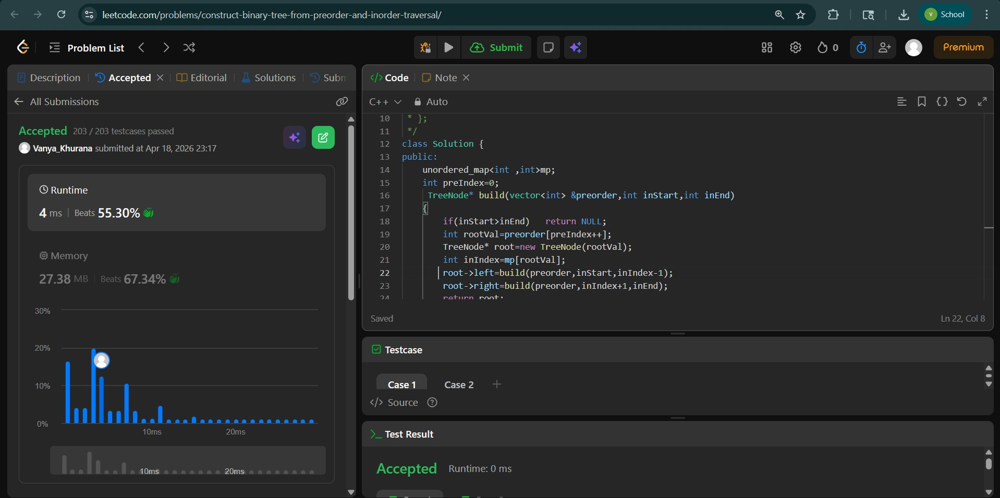
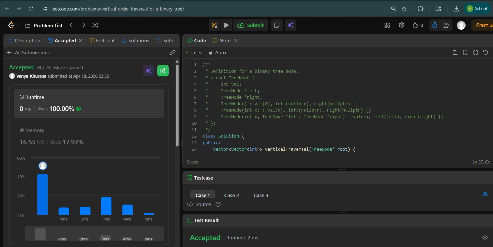

# Day - 28
## Beginner Level 


```cpp
class Solution {
public:
    bool isSubtree(TreeNode* root, TreeNode* subRoot) {
        if (!root) return false;
        if (isSameTree(root, subRoot)) return true;
        return isSubtree(root->left, subRoot) || isSubtree(root->right, subRoot);
    }
    private:
    bool isSameTree(TreeNode* p, TreeNode* q) {
        if (!p && !q) return true;
        if (!p || !q) return false;
        if (p->val != q->val) return false;
        return isSameTree(p->left, q->left) && isSameTree(p->right, q->right);
    }

};
```

### Output


## Intermediate Level


```cpp
class Solution {
public:
    unordered_map<int ,int>mp;
    int preIndex=0;
     TreeNode* build(vector<int> &preorder,int inStart,int inEnd)
    {   
        if(inStart>inEnd)   return NULL;
        int rootVal=preorder[preIndex++];
        TreeNode* root=new TreeNode(rootVal);
        int inIndex=mp[rootVal];
        root->left=build(preorder,inStart,inIndex-1);
        root->right=build(preorder,inIndex+1,inEnd);
        return root;
    }
    TreeNode* buildTree(vector<int>& preorder, vector<int>& inorder) {
        for(int i=0;i<inorder.size();i++)   mp[inorder[i]]=i;
        return build(preorder,0,inorder.size()-1);
    }
};
```

### Output


## Advanced Level


```cpp
vector<vector<int>> verticalTraversal(TreeNode* root) {
        map<int,map<int,multiset<int>>> nodes;
        queue<pair<TreeNode*,pair<int,int>>> q;
        q.push({root,{0,0}});
        while(q.size()!=0)
        {
            auto p=q.front();
            q.pop();
            TreeNode* node=p.first;
            int x=p.second.first;
            int y=p.second.second;
            nodes[x][y].insert(node->val);
            if(node->left)  q.push({node->left,{x-1,y+1}});
            if(node->right)  q.push({node->right,{x+1,y+1}});
        }
        vector<vector<int>> ans;
        for(auto r:nodes)
        {
            vector<int> col;
            for(auto s:r.second)
            {
                for( auto val:s.second)   col.push_back(val);
            }
            ans.push_back(col);
        }
        return ans;
    }
};
```

### Output

