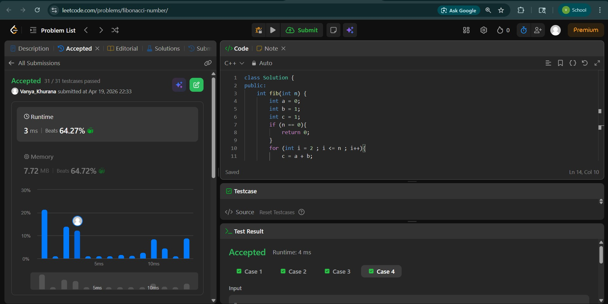
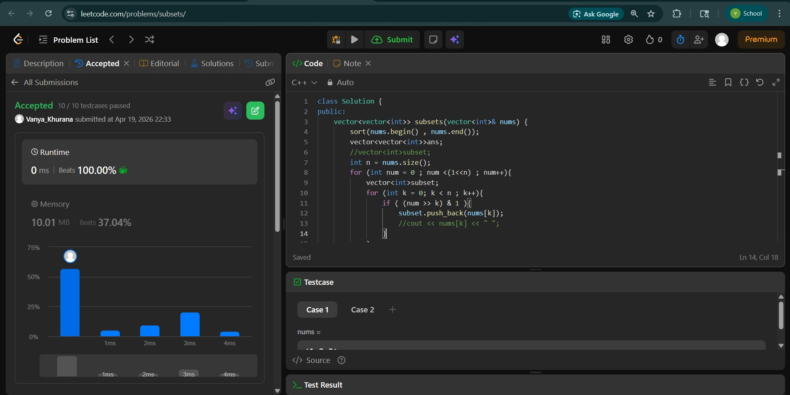
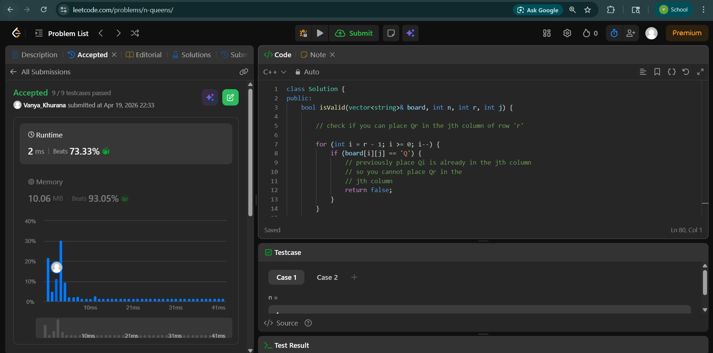

# Day - 29
## Beginner Level 


```cpp
class Solution {
public:
    int fib(int n) {
        int a = 0;
        int b = 1;
        int c = 1;
        if (n == 0){
            return 0;
        }
        for (int i = 2 ; i <= n ; i++){
            c = a + b;
            a = b;
            b = c;
        }
        return c;
    }
};
```

### Output


## Intermediate Level


```cpp
class Solution {
public:
    vector<vector<int>> subsets(vector<int>& nums) {
        sort(nums.begin() , nums.end());
        vector<vector<int>>ans;
        //vector<int>subset;
        int n = nums.size();
        for (int num = 0 ; num <(1<<n) ; num++){
            vector<int>subset;
            for (int k = 0; k < n ; k++){
                if ( (num >> k) & 1 ){
                    subset.push_back(nums[k]);
                    //cout << nums[k] << " ";
                }
            }
            //cout << endl;
            ans.push_back(subset);
        }
        return ans;
    }
};
```

### Output


## Advanced Level


```cpp
class Solution {
public:
    bool isValid(vector<string>& board, int n, int r, int j) {

		// check if you can place Qr in the jth column of row 'r'

		for (int i = r - 1; i >= 0; i--) {
			if (board[i][j] == 'Q') {
				// previously place Qi is already in the jth column
				// so you cannot place Qr in the
				// jth column
				return false;
			}
		}

		int step = 1;
		for (int i = r - 1; i >= 0 and j + step < n; i--) {
			if (board[i][j + step] == 'Q') {
				// previously placed Qi is present along the right diagonal
				// of jth column therefore you cannot place Qr in the jth
				// column of row r
				return false;
			}
			step++;
		}

		step = 1;
		for (int i = r - 1; i >= 0 and j - step >= 0; i--) {
			if (board[i][j - step] == 'Q') {
				// previously placed Qi is present along the left diagonal
				// of jth column therefore you cannot place Qr in the jth
				// column of row r
				return false;
			}
			step++;
		}

		// you can place Qr in the jth column of row r
		return true;

	}

	void f(int n, int r, vector<string>& board, vector<vector<string>>& ans) {

		// base case

		if (r == n) {
			ans.push_back(board);
			return;
		}

		// recursive case

		// f(r) : take decisions for remaining queens Qr to Qn-1

		// decide for Qr

		for (int j = 0; j < n; j++) {

			// can I place Qr in the jth column of row 'r'

			if (isValid(board, n, r, j)) {
				board[r][j] = 'Q';
				f(n, r + 1, board, ans);
				board[r][j] = '.';
			}

		}

	}
    vector<vector<string>> solveNQueens(int n) {
        vector<vector<string>> ans;

		vector<string> board;
		for (int i = 0; i < n; i++) {
			board.push_back(string(n, '.'));
		}

		f(n, 0, board, ans);

		return ans;
    }
};
```

### Output

