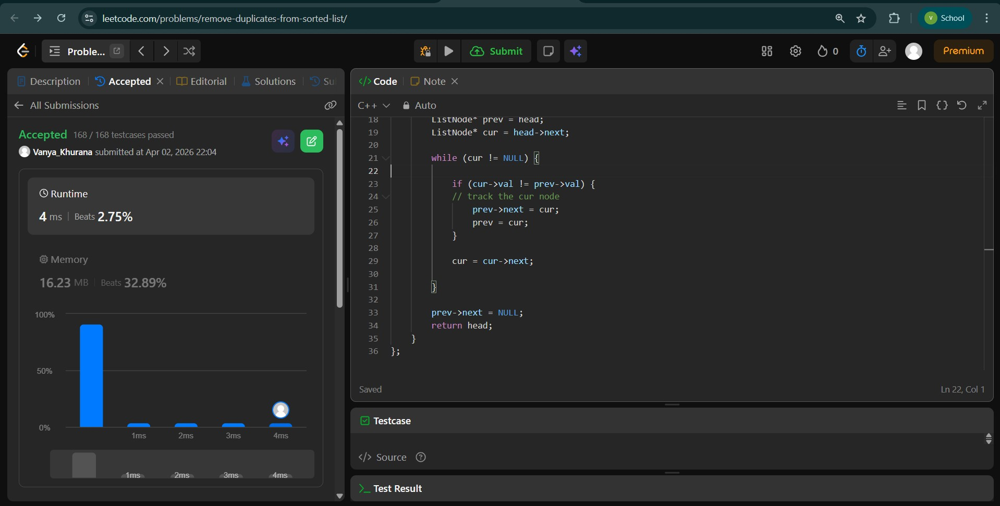
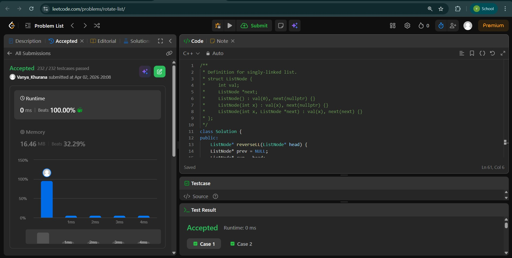
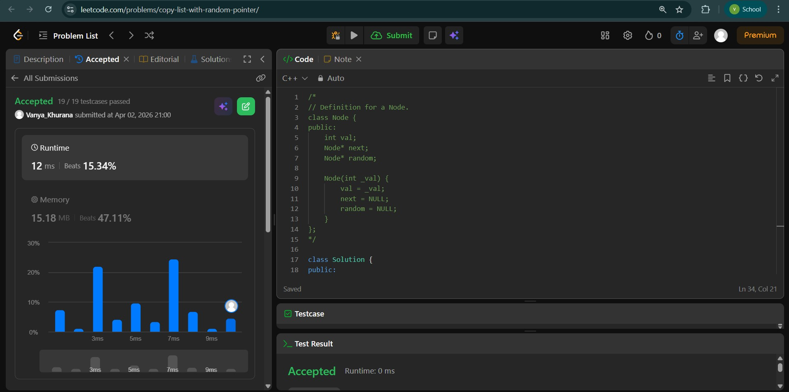

# Day - 12
## Beginner Level 


```cpp
class Solution {
public:
    ListNode* deleteDuplicates(ListNode* head) {
        if (head == NULL || head->next == NULL) {
		    return head;
	    }

	    ListNode* prev = head;
	    ListNode* cur = head->next;

	    while (cur != NULL) {

		    if (cur->val != prev->val) {
			// track the cur node
			    prev->next = cur;
			    prev = cur;
		    }

		    cur = cur->next;

	    }

	    prev->next = NULL;
        return head;
    }
};
```

### Output


## Intermediate Level


```cpp
class Solution {
public:
    ListNode* reverseLL(ListNode* head) {
    ListNode* prev = NULL;
    ListNode* cur = head;

    while (cur != NULL) {
        ListNode* next = cur->next;
        cur->next = prev;
        prev = cur;
        cur = next;
    }
    return prev;
}

ListNode* rotateRight(ListNode* head, int k) {
    if (!head || !head->next || k == 0) return head;

    // Step 1: find length
    int n = 0;
    ListNode* cur = head;
    while (cur) {
        n++;
        cur = cur->next;
    }

    k = k % n;
    if (k == 0) return head;

    // Step 2: reverse whole list
    ListNode* new_head = reverseLL(head);

    // Step 3: move to kth node
    ListNode* temp = new_head;
    for (int i = 1; i < k; i++) {
        temp = temp->next;
    }

    // Step 4: split into two parts
    ListNode* head2 = temp->next;
    temp->next = NULL;

    // Step 5: reverse both parts
    ListNode* first = reverseLL(new_head);
    ListNode* second = reverseLL(head2);

    // Step 6: join properly
    ListNode* tail = first;
    while (tail->next) {
        tail = tail->next;
    }
    tail->next = second;

    return first;
}
};
```

### Output


## Advanced Level


```cpp
class Solution {
public:
    Node* copyRandomList(Node* head) {
        unordered_map<Node*,Node*>mp;
        Node*temp = head;
        Node*copyNode = new Node(-1);
        Node*newNode = copyNode;
        Node*ansll= copyNode;
        while (head != NULL){
            copyNode->next = new Node(head->val);
            copyNode = copyNode->next;
            mp[head] = copyNode;
            head = head->next;
        }
        newNode = newNode->next;
        ansll = ansll->next;
        while(temp != NULL){
            newNode->random = mp[temp->random];
            newNode = newNode->next;
            temp = temp->next;
        }
        return ansll;
    }
};
```

### Output

