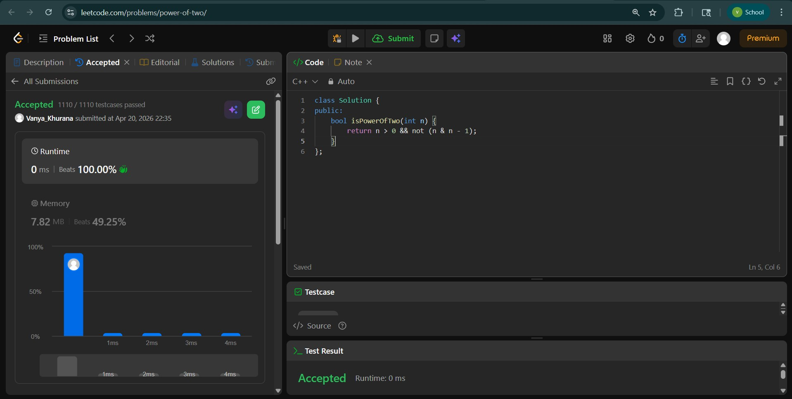
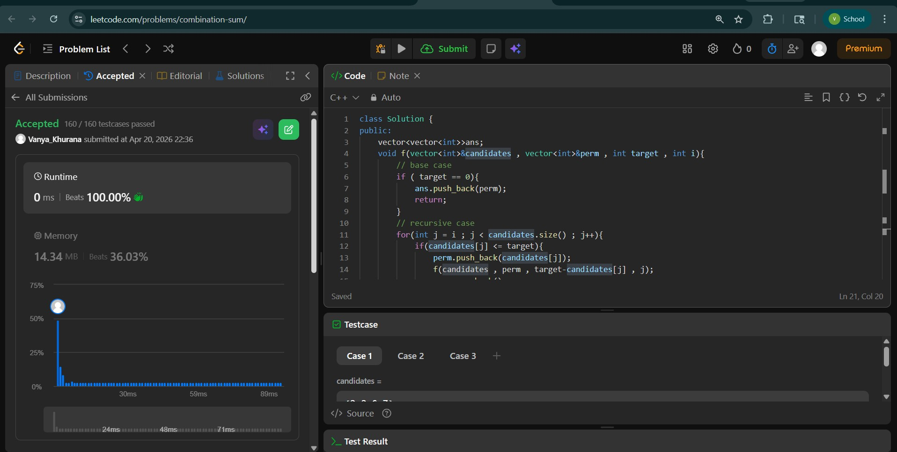
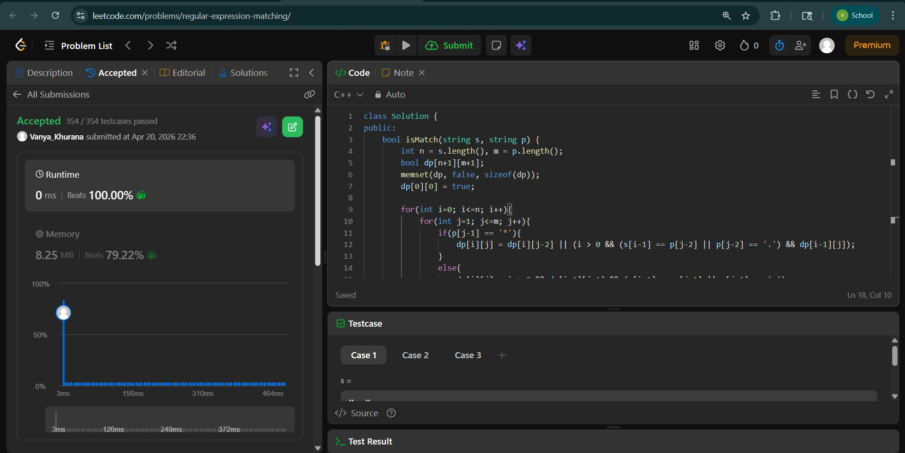

# Day - 30
## Beginner Level 


```cpp
class Solution {
public:
    bool isPowerOfTwo(int n) {
        return n > 0 && not (n & n - 1);
    }
};
```

### Output


## Intermediate Level


```cpp
class Solution {
public:
    vector<vector<int>>ans;
    void f(vector<int>&candidates , vector<int>&perm , int target , int i){
        // base case
        if ( target == 0){
            ans.push_back(perm);
            return;
        }
        // recursive case
        for(int j = i ; j < candidates.size() ; j++){
            if(candidates[j] <= target){
                perm.push_back(candidates[j]);
                f(candidates , perm , target-candidates[j] , j);
                perm.pop_back();
            }
        }
    }
    vector<vector<int>> combinationSum(vector<int>& candidates, int target) {
        vector<int>perm;
        f(candidates , perm , target , 0);
        return ans;
    }
};
```

### Output


## Advanced Level


```cpp
class Solution {
public:
    bool isMatch(string s, string p) {
        int n = s.length(), m = p.length();
        bool dp[n+1][m+1];
        memset(dp, false, sizeof(dp));
        dp[0][0] = true;
        
        for(int i=0; i<=n; i++){
            for(int j=1; j<=m; j++){
                if(p[j-1] == '*'){
                    dp[i][j] = dp[i][j-2] || (i > 0 && (s[i-1] == p[j-2] || p[j-2] == '.') && dp[i-1][j]);
                }
                else{
                    dp[i][j] = i > 0 && dp[i-1][j-1] && (s[i-1] == p[j-1] || p[j-1] == '.');
                }
            }
        }
        
        return dp[n][m];
    }
};
```

### Output

