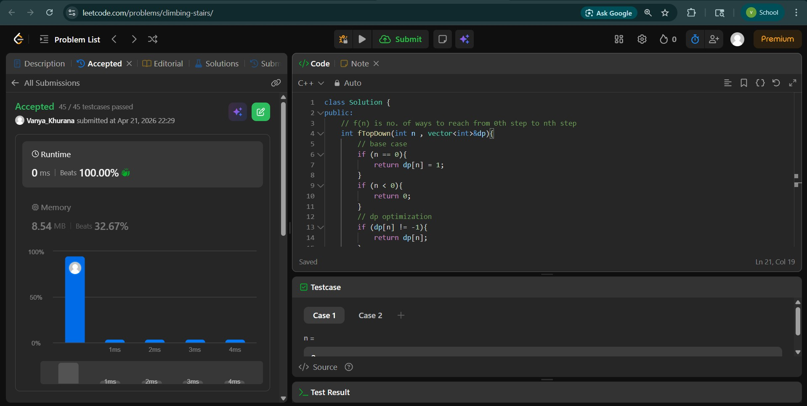
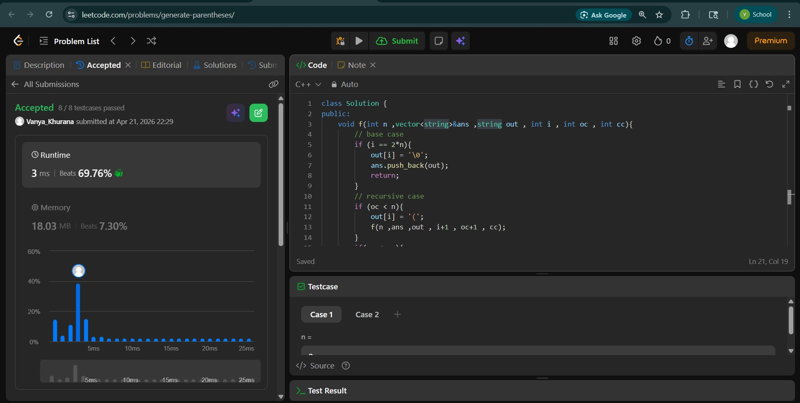
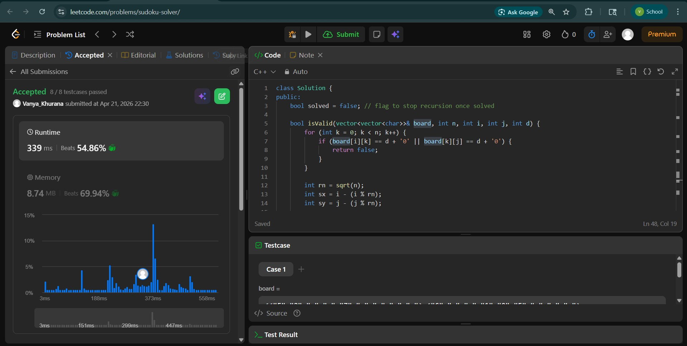

# Day - 31
## Beginner Level 


```cpp
class Solution {
public:
    // f(n) is no. of ways to reach from 0th step to nth step
    int fTopDown(int n , vector<int>&dp){
        // base case
        if (n == 0){
            return dp[n] = 1;
        }
        if (n < 0){
            return 0;
        }
        // dp optimization
        if (dp[n] != -1){
            return dp[n];
        }
        // recursive case
        int cnt = 0;
        // here we have 2 options 
        // 1st climb 1 stair
        cnt += fTopDown(n-1 , dp);
        // 2nd climb 2 stairs
        cnt += fTopDown(n-2 , dp);
        return dp[n] = cnt;
    }
    int climbStairs(int n) {
        vector<int>dp(n+1 , -1);
        int ans = fTopDown(n , dp);
        return ans;
    }
};
```

### Output


## Intermediate Level


```cpp
class Solution {
public:
    void f(int n ,vector<string>&ans ,string out , int i , int oc , int cc){
        // base case
        if (i == 2*n){
            out[i] = '\0';
            ans.push_back(out);
            return;
        }
        // recursive case
        if (oc < n){
            out[i] = '(';
            f(n ,ans ,out , i+1 , oc+1 , cc);
        }
        if(cc < oc){
            out[i] = ')';
            f(n ,ans, out , i+1 , oc , cc+1);
        }
    }
    vector<string> generateParenthesis(int n) {
        vector<string>ans;
        string out(2*n , 'X');
        f(n , ans ,out , 0 , 0 , 0);
        return ans;
    }
};
```

### Output


## Advanced Level


```cpp
class Solution {
public:
    bool solved = false; // flag to stop recursion once solved

    bool isValid(vector<vector<char>>& board, int n, int i, int j, int d) {
        for (int k = 0; k < n; k++) {
            if (board[i][k] == d + '0' || board[k][j] == d + '0') {
                return false;
            }
        }

        int rn = sqrt(n);
        int sx = i - (i % rn);
        int sy = j - (j % rn);

        for (int x = sx; x < sx + rn; x++) {
            for (int y = sy; y < sy + rn; y++) {
                if (board[x][y] == d + '0') {
                    return false;
                }
            }
        }

        return true;
    }

    void f(vector<vector<char>>& board, int n, int i, int j) {
        if (i == n) {
            solved = true;
            return;
        }

        if (j == n) {
            f(board, n, i + 1, 0);
            return;
        }

        if (board[i][j] != '.') {
            f(board, n, i, j + 1);
            return;
        }

        for (int d = 1; d <= 9; d++) {
            if (isValid(board, n, i, j, d)) {
                board[i][j] = d + '0';
                f(board, n, i, j + 1);
                if (solved) return; // backtrack only if not solved
                board[i][j] = '.';
            }
        }
    }

    void solveSudoku(vector<vector<char>>& board) {
        f(board, 9, 0, 0);
    }
};

```

### Output

