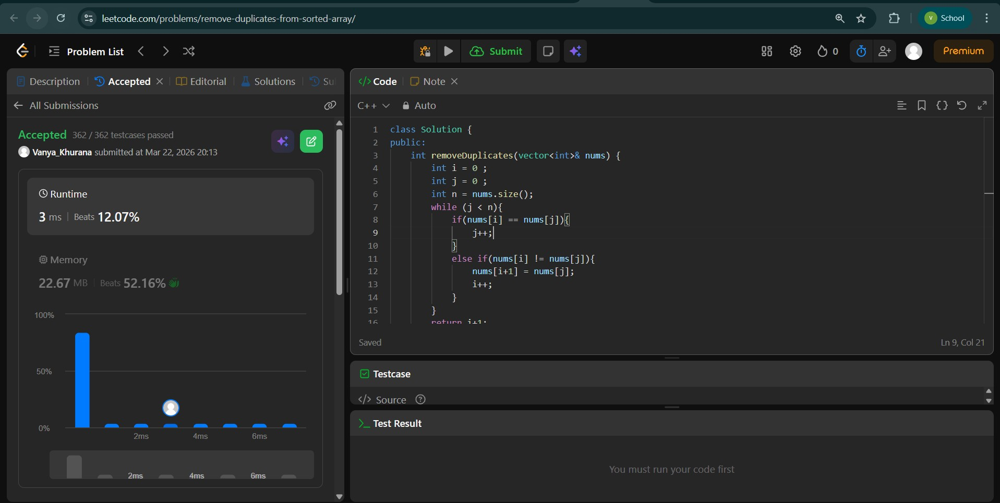
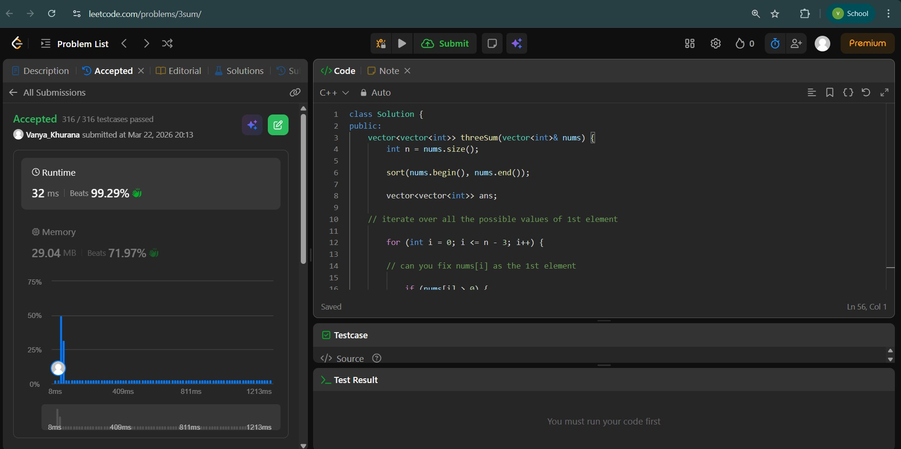
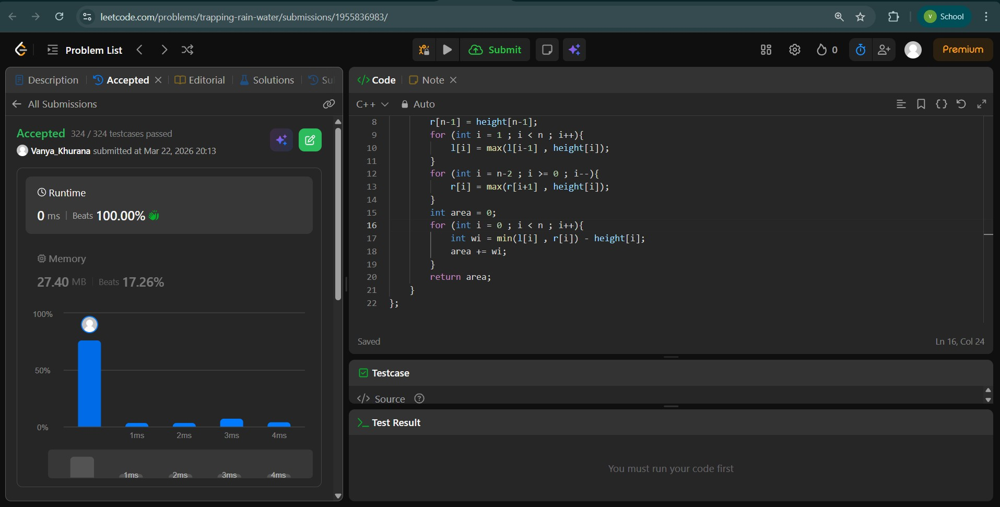

# Day - 1
## Beginner Level 


```cpp
class Solution {
public:
    int removeDuplicates(vector<int>& nums) {
        int i = 0 ; 
        int j = 0 ;
        int n = nums.size();
        while (j < n){
            if(nums[i] == nums[j]){
                j++;
            }
            else if(nums[i] != nums[j]){
                nums[i+1] = nums[j];
                i++;
            }
        }
        return i+1;
    }
};
```

### Output


## Intermediate Level


```cpp
class Solution {
public:
    vector<vector<int>> threeSum(vector<int>& nums) {
        int n = nums.size();

	    sort(nums.begin(), nums.end());

	    vector<vector<int>> ans;

	// iterate over all the possible values of 1st element

	    for (int i = 0; i <= n - 3; i++) {

		// can you fix nums[i] as the 1st element

		    if (nums[i] > 0) {
			    break;
		    }

		    if (i > 0 and nums[i] == nums[i - 1]) {
			    continue;
		    }

		// fix nums[i] as the 1st element of the triplet

		// now, search for the pair nums[j], nums[k] in [i+1...n-1]

		// such that nums[j] + nums[k] = -num[i]

		    int t = -nums[i];
		    int j = i + 1;
		    int k = n - 1;

		    while (j < k) {
			    int pairSum = nums[j] + nums[k];
			    if (pairSum == t) {
				// you've found a valid triplet
				    ans.push_back({nums[i], nums[j], nums[k]});
				    j++;
				    k--;

				    while (j < k and nums[j] == nums[j - 1]) j++;
				    while (j < k and nums[k] == nums[k + 1]) k--;

			    } else if (pairSum > t) {
				    k--;
			    } else {
				// pairSum < t
				    j++;
			}
		}

	}

	return ans;

    }
};
```

### Output


## Advanced Level


```cpp
class Solution {
public:
    int trap(vector<int>& height) {
        int n = height.size();
        vector<int> l(n);
        vector<int> r(n);
        l[0] = height[0];
        r[n-1] = height[n-1];
        for (int i = 1 ; i < n ; i++){
            l[i] = max(l[i-1] , height[i]);
        }
        for (int i = n-2 ; i >= 0 ; i--){
            r[i] = max(r[i+1] , height[i]);
        }
        int area = 0;
        for (int i = 0 ; i < n ; i++){
            int wi = min(l[i] , r[i]) - height[i];
            area += wi;
        }
        return area;        
    }
};
```

### Output

