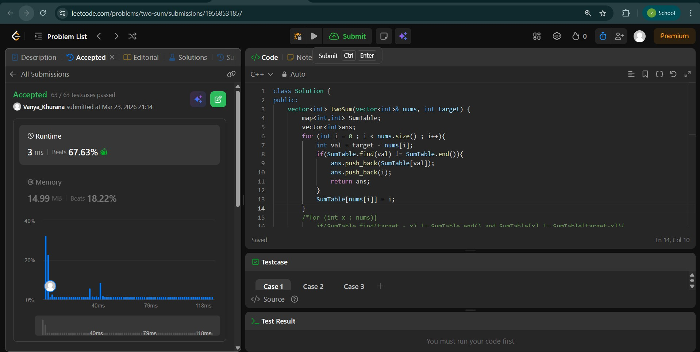
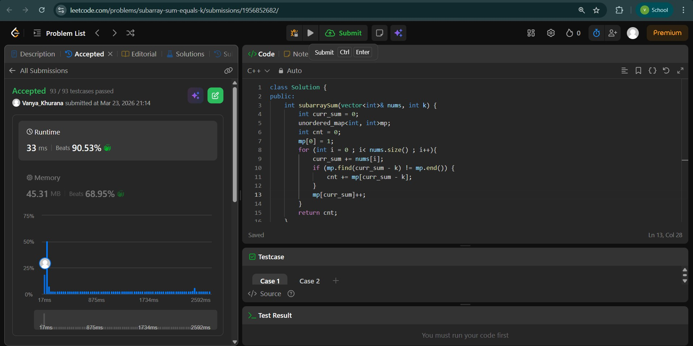
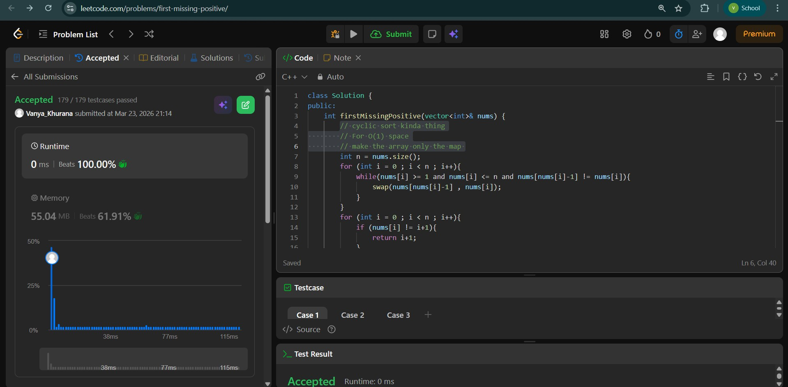

# Day - 2
## Beginner Level 


```cpp
class Solution {
public:
    vector<int> twoSum(vector<int>& nums, int target) {
        map<int,int> SumTable;
        vector<int>ans;
        for (int i = 0 ; i < nums.size() ; i++){
            int val = target - nums[i];
            if(SumTable.find(val) != SumTable.end()){
                ans.push_back(SumTable[val]);
                ans.push_back(i);
                return ans;
            }
            SumTable[nums[i]] = i;
        }
        /*for (int x : nums){
            if(SumTable.find(target - x) != SumTable.end() and SumTable[x] != SumTable[target-x]){
                ans.push_back(SumTable[x]);
                ans.push_back(SumTable[target-x]);
                return ans;
            }
            if(x == target - x){
                if(SumTable.count(x) > 1){
                    ans.push_back(SumTable[x]);
                    ans.push_back(SumTable[target-x]);
                    return ans;
                }
        }
    }
        return ans;*/
        return ans;
    }
};
```

### Output


## Intermediate Level


```cpp
class Solution {
public:
    int subarraySum(vector<int>& nums, int k) {
        int curr_sum = 0;
        unordered_map<int, int>mp;
        int cnt = 0;
        mp[0] = 1;    
        for (int i = 0 ; i< nums.size() ; i++){
            curr_sum += nums[i];
            if (mp.find(curr_sum - k) != mp.end()) {
                cnt += mp[curr_sum - k];
            }
            mp[curr_sum]++;
        }
        return cnt;
    }
};
```

### Output


## Advanced Level


```cpp
class Solution {
public:
    int firstMissingPositive(vector<int>& nums) {
        // cyclic sort kinda thing
        // For O(1) space
        // make the array only the map 
        int n = nums.size();
        for (int i = 0 ; i < n ; i++){
            while(nums[i] >= 1 and nums[i] <= n and nums[nums[i]-1] != nums[i]){
                swap(nums[nums[i]-1] , nums[i]);
            }
        }
        for (int i = 0 ; i < n ; i++){
            if (nums[i] != i+1){
                return i+1;
            }
        }
        return n+1;
    }
};
```

### Output

