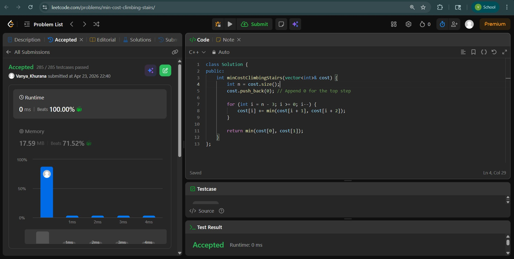
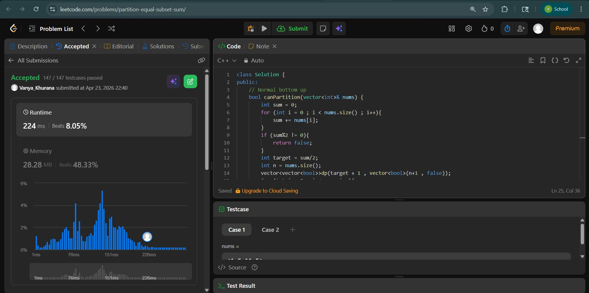
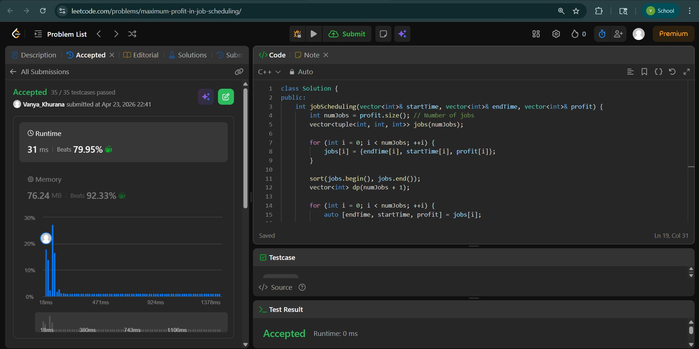

# Day - 33
## Beginner Level 


```cpp
class Solution {
public:
    int minCostClimbingStairs(vector<int>& cost) {
        int n = cost.size();
        cost.push_back(0); // Append 0 for the top step

        for (int i = n - 3; i >= 0; i--) {
            cost[i] += min(cost[i + 1], cost[i + 2]);
        }

        return min(cost[0], cost[1]);       
    }
};
```

### Output


## Intermediate Level


```cpp
class Solution {
public:
    // Normal bottom up
    bool canPartition(vector<int>& nums) {
        int sum = 0;
        for (int i = 0 ; i < nums.size() ; i++){
            sum += nums[i];
        }
        if (sum%2 != 0){
            return false;
        }
        int target = sum/2;
        int n = nums.size();
        vector<vector<bool>>dp(target + 1 , vector<bool>(n+1 , false));
        for (int i = 0 ; i <= n ; i++){
            dp[0][i] = true;
        }
        for (int t = 1; t <= target; t++){
            dp[t][n] = false;
        }

        for (int i = n - 1; i >= 0 ; i--){
            for (int t = 0 ; t <= target ; t++){
                bool notaken = dp[t][i+1];
                bool taken = false;
                if (nums[i] <= t){
                    taken = dp[t-nums[i]][i+1];
                }
                dp[t][i] = taken or notaken;
            }
        }
        return dp[target][0];
    }
};
```

### Output


## Advanced Level


```cpp
class Solution {
public:
    int jobScheduling(vector<int>& startTime, vector<int>& endTime, vector<int>& profit) {
        int numJobs = profit.size(); // Number of jobs
        vector<tuple<int, int, int>> jobs(numJobs);
      
        for (int i = 0; i < numJobs; ++i) {
            jobs[i] = {endTime[i], startTime[i], profit[i]};
        }
      
        sort(jobs.begin(), jobs.end());
        vector<int> dp(numJobs + 1);
      
        for (int i = 0; i < numJobs; ++i) {
            auto [endTime, startTime, profit] = jobs[i];
          
            int latestNonConflictJobIndex = upper_bound(jobs.begin(), jobs.begin() + i, startTime, [&](int time, const auto& job) -> bool {
                return time < get<0>(job);
            }) - jobs.begin();
          
            dp[i + 1] = max(dp[i], dp[latestNonConflictJobIndex] + profit);
        }
      
        return dp[numJobs];
    }
};

```

### Output

