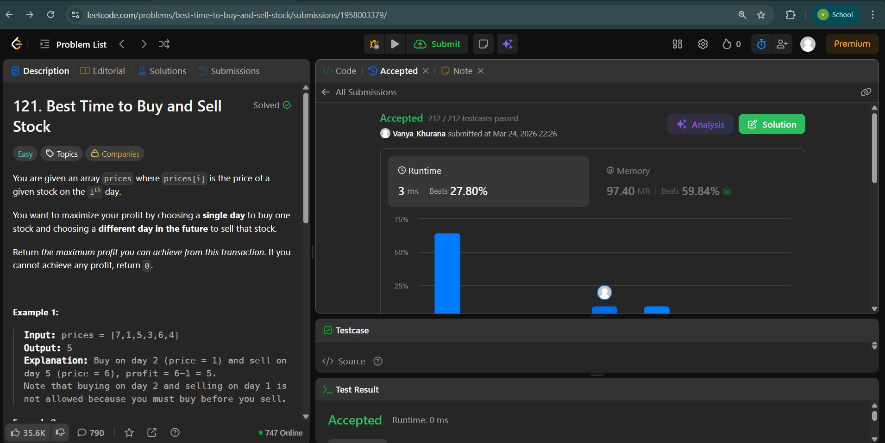
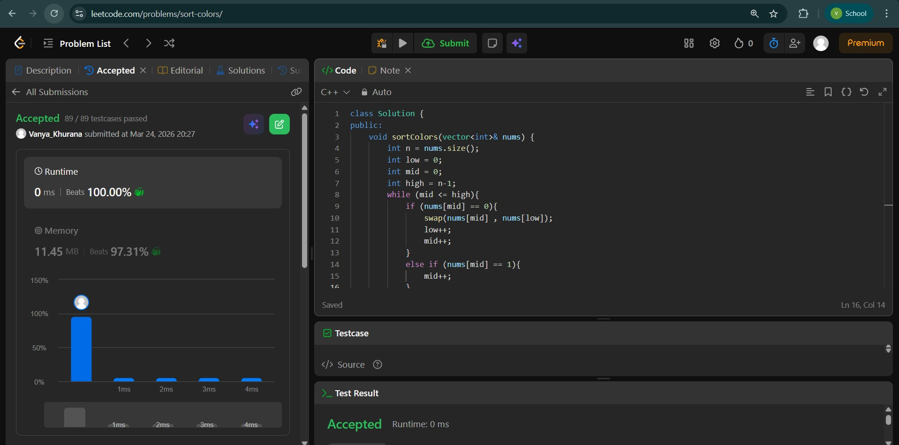

# Day - 3
## Beginner Level 


```cpp
class Solution {
public:
    int maxProfit(vector<int>& prices) {
        int maxprofit = 0;
        int smallest = 0;
        int largest = 0;
        int n = prices.size();
        for (int i = 0 ; i < n ; i++){
            if (prices[i] > prices[smallest] and i >= smallest){
                largest = i;
                maxprofit = max(maxprofit , prices[largest]-prices[smallest]);
            }
            else if (prices[i] < prices[largest]){
                smallest = i;
            }
        }
        return maxprofit;
    }
};
```

### Output


## Intermediate Level


```cpp
class Solution {
public:
    void sortColors(vector<int>& nums) {
        int n = nums.size();
        int low = 0;
        int mid = 0;
        int high = n-1;
        while (mid <= high){
            if (nums[mid] == 0){
                swap(nums[mid] , nums[low]);
                low++;
                mid++;
            }
            else if (nums[mid] == 1){
                mid++;
            }
            else{
                swap(nums[mid] , nums[high]);
                high--;
            }
        }
    }
};
```

### Output


## Advanced Level


```cpp
vector<int> NearestSmallerRight(vector<int>&heights){
        stack<int>s;
        vector<int>ans;
        for (int i = heights.size() - 1 ; i >= 0 ; i--){
            while(!s.empty() and heights[i] <= heights[s.top()]){
                s.pop();
            }
            if (s.empty()){
                ans.push_back(heights.size());
            }
            else{
                ans.push_back(s.top());
            }
            s.push(i);
        }
        reverse(ans.begin() , ans.end());
        return ans;
    }
    vector<int> NearestSmallerLeft(vector<int>&heights){
        stack<int>s;
        vector<int>ans;
        for (int i = 0 ; i < heights.size() ; i++){
            while(!s.empty() and heights[i] <= heights[s.top()]){
                s.pop();
            }
            if (s.empty()){
                ans.push_back(-1);
            }
            else{
                ans.push_back(s.top());
            }
            s.push(i);
        }
        return ans;
    }
    int largestRectangleArea(vector<int>& heights) {
        vector<int>rightSmaller = NearestSmallerRight(heights); // For next smaller at right 
        vector<int>leftSmaller = NearestSmallerLeft(heights); // For next smaller at left
        int maxsofar = 0;
        for (int i = 0 ; i < heights.size() ; i++){
            int width = rightSmaller[i] - leftSmaller[i] - 1 ;
            int length = heights[i];
            int area = width*length;
            maxsofar = max(maxsofar,area);
        }
        return maxsofar;
    }
```

### Output

