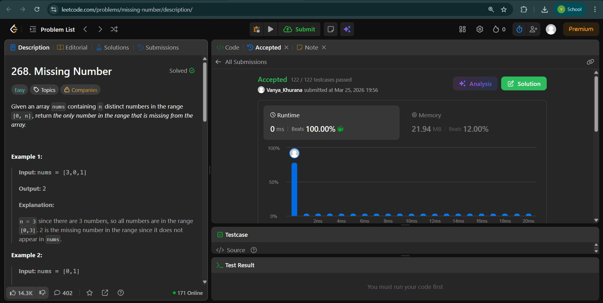
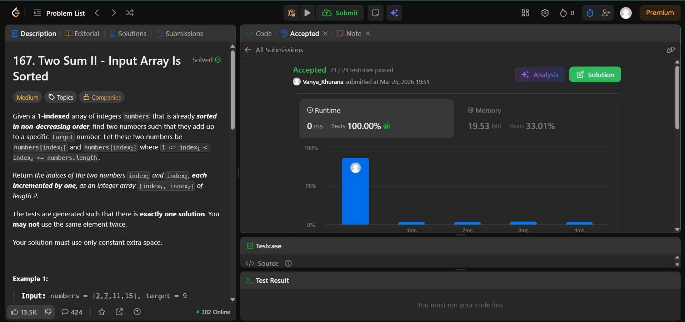
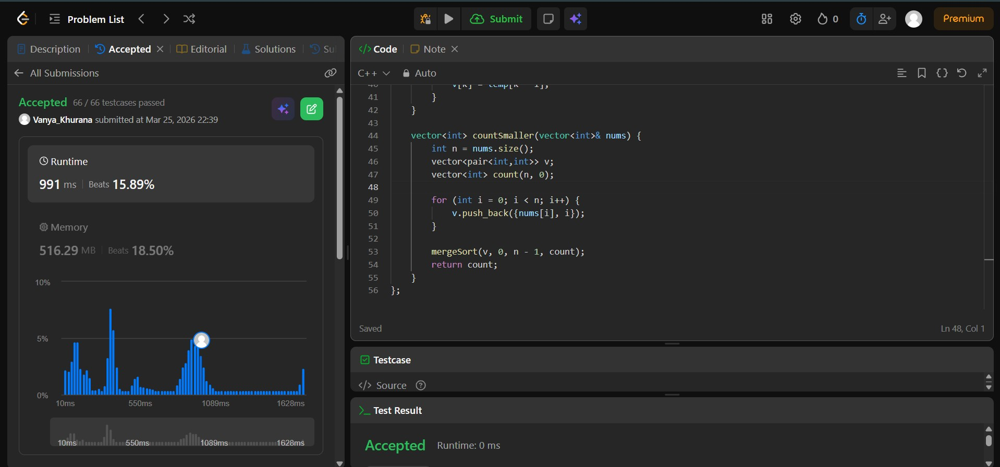

# Day - 4
## Beginner Level 


```cpp
class Solution {
public:
    int missingNumber(vector<int>& nums) {
        int n = nums.size() ;
        vector<bool>mapping(n+1 , false);
        for (int num : nums){
            mapping[num] = true;
        }
        for (int i = 0 ; i < n + 1 ; i++){
            if (mapping[i] == false){
                return i;
            }
        }
        return -1;
    }
};
```

### Output


## Intermediate Level


```cpp
class Solution {
public:
    vector<int> twoSum(vector<int>& numbers, int target) {
        // array is already sorted
        int i = 0;
        int j = numbers.size() - 1;
        vector<int>ans(2);
        while (i < j){
            int sum = numbers[i] + numbers[j];
            if (sum < target){
                i++;
            }
            else if (sum > target){
                j--;
            }
            else{
                ans[0] = i + 1;
                ans[1] = j + 1;
                i++;
                j--;
            }
        }
        return ans;
    }
};
```

### Output


## Advanced Level


```cpp
class Solution {
public:
    void mergeSort(vector<pair<int,int>>& v, int l, int r, vector<int>& count) {
        if (l >= r) return;

        int mid = (l + r) / 2;
        mergeSort(v, l, mid, count);
        mergeSort(v, mid + 1, r, count);

        vector<pair<int,int>> temp;
        int i = l, j = mid + 1;
        int rightCount = 0;

        while (i <= mid && j <= r) {
            if (v[j].first < v[i].first) {
                // right element is smaller
                temp.push_back(v[j]);
                rightCount++;
                j++;
            } else {
                // left element gets count
                count[v[i].second] += rightCount;
                temp.push_back(v[i]);
                i++;
            }
        }

        while (i <= mid) {
            count[v[i].second] += rightCount;
            temp.push_back(v[i]);
            i++;
        }

        while (j <= r) {
            temp.push_back(v[j]);
            j++;
        }

        for (int k = l; k <= r; k++) {
            v[k] = temp[k - l];
        }
    }

    vector<int> countSmaller(vector<int>& nums) {
        int n = nums.size();
        vector<pair<int,int>> v;
        vector<int> count(n, 0);

        for (int i = 0; i < n; i++) {
            v.push_back({nums[i], i});
        }

        mergeSort(v, 0, n - 1, count);
        return count;
    }
};
```

### Output

