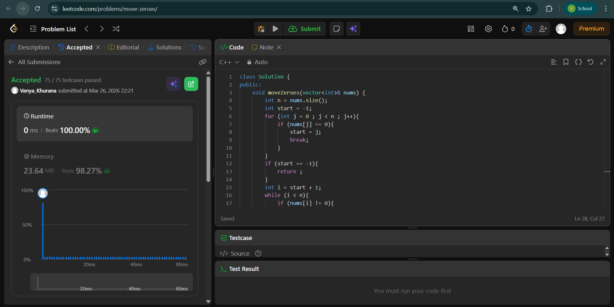
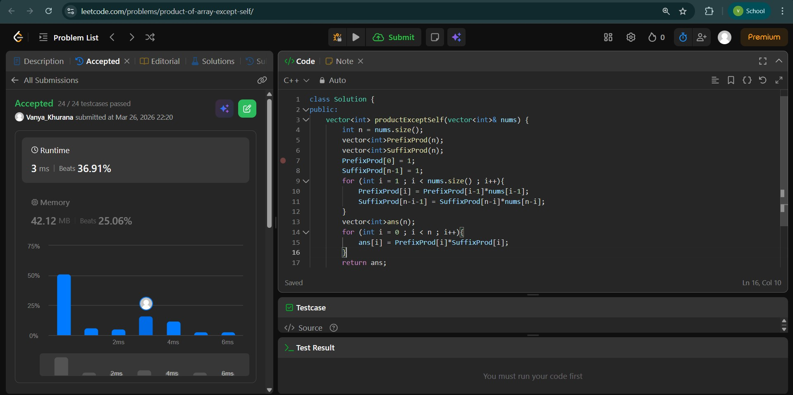
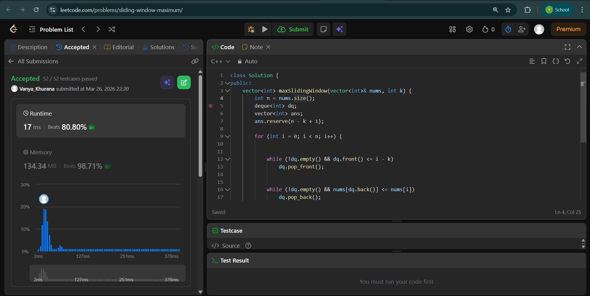

# Day - 5
## Beginner Level 


```cpp
class Solution {
public:
    void moveZeroes(vector<int>& nums) {
        int n = nums.size();
        int start = -1;
        for (int j = 0 ; j < n ; j++){
            if (nums[j] == 0){
                start = j;
                break;
            }
        }
        if (start == -1){
            return ;
        }
        int i = start + 1;
        while (i < n){
            if (nums[i] != 0){
                if(nums[start] == 0){
                    swap(nums[i] , nums[start]);
                    start++;
                    i++;
                }
                else{
                    start++;
                }
            }
            else{
                i++;
            }
        }
    }
};
```

### Output


## Intermediate Level


```cpp
class Solution {
public:
    vector<int> productExceptSelf(vector<int>& nums) {
        int n = nums.size();
        vector<int>PrefixProd(n);
        vector<int>SuffixProd(n);
        PrefixProd[0] = 1;
        SuffixProd[n-1] = 1;
        for (int i = 1 ; i < nums.size() ; i++){
            PrefixProd[i] = PrefixProd[i-1]*nums[i-1];
            SuffixProd[n-i-1] = SuffixProd[n-i]*nums[n-i];
        }
        vector<int>ans(n);
        for (int i = 0 ; i < n ; i++){
            ans[i] = PrefixProd[i]*SuffixProd[i];
        }
        return ans;
    }
};
```

### Output


## Advanced Level


```cpp
class Solution {
public:
    vector<int> maxSlidingWindow(vector<int>& nums, int k) {
        int n = nums.size();
        deque<int> dq;
        vector<int> ans;
        ans.reserve(n - k + 1); 

        for (int i = 0; i < n; i++) {

            
            while (!dq.empty() && dq.front() <= i - k)
                dq.pop_front();

            
            while (!dq.empty() && nums[dq.back()] <= nums[i])
                dq.pop_back();

            dq.push_back(i);

          
            if (i >= k - 1)
                ans.push_back(nums[dq.front()]);
        }

        return ans;
    }
};
```

### Output

