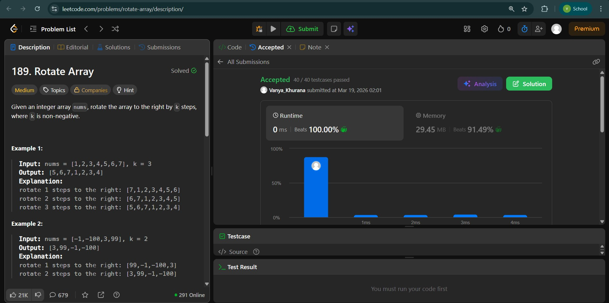
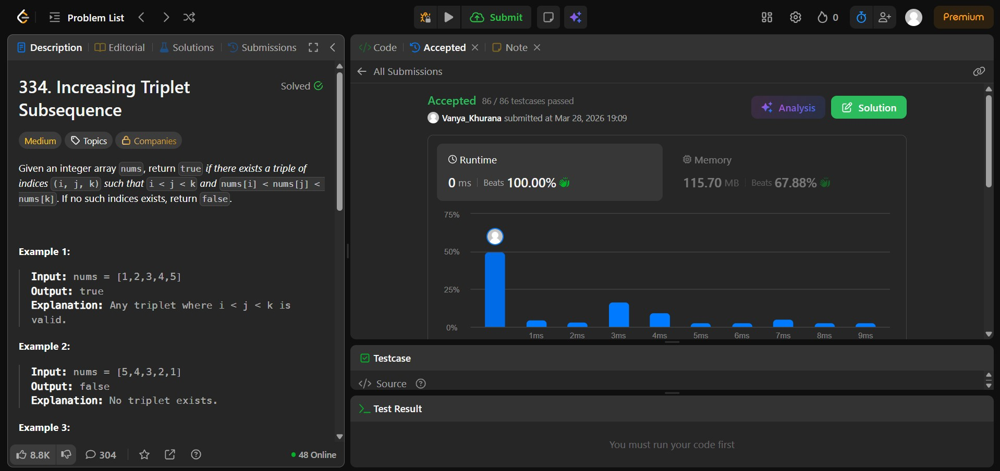
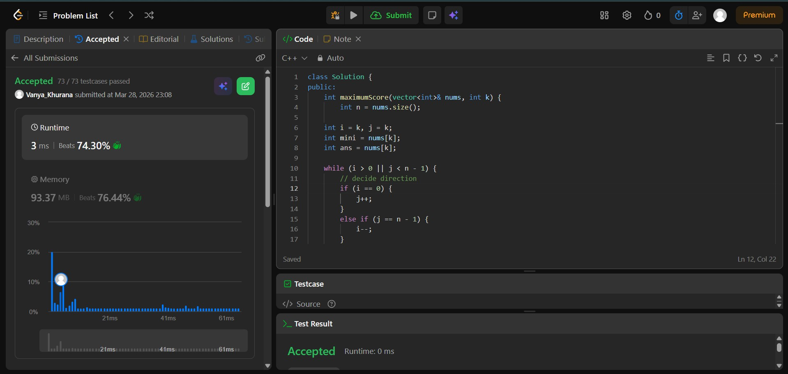

# Day - 7
## Beginner Level 


```cpp
class Solution {
public:
    void rotate(vector<int>& nums, int k) {
        int n = nums.size();
        k %= n;
        reverse(nums.begin() , nums.end());
        reverse(nums.begin() , nums.begin() + k);
        reverse(nums.begin() + k , nums.end()); 
    }
};
```

### Output


## Intermediate Level


```cpp
class Solution {
public:
    bool increasingTriplet(vector<int>& nums) {
        int n = nums.size();
    if (n < 3) return false;

    int minval = nums[0];        // smallest
    int second = INT_MAX;        // second smallest

    for (int i = 1; i < n; i++) {
        if (nums[i] <= minval) {
            minval = nums[i];   // update smallest
        }
        else if (nums[i] <= second) {
            second = nums[i];   // update second smallest
        }
        else {
            return true;        // found third > second
        }
    }
    return false;
    }
};
```

### Output


## Advanced Level


```cpp
class Solution {
public:
    int maximumScore(vector<int>& nums, int k) {
        int n = nums.size();
    
    int i = k, j = k;
    int mini = nums[k];
    int ans = nums[k];
    
    while (i > 0 || j < n - 1) {
        // decide direction
        if (i == 0) {
            j++;
        }
        else if (j == n - 1) {
            i--;
        }
        else if (nums[i - 1] > nums[j + 1]) {
            i--;
        }
        else {
            j++;
        }
        
        mini = min(mini, min(nums[i], nums[j]));
        ans = max(ans, mini * (j - i + 1));
    }
    
    return ans;
    }
};
```

### Output

