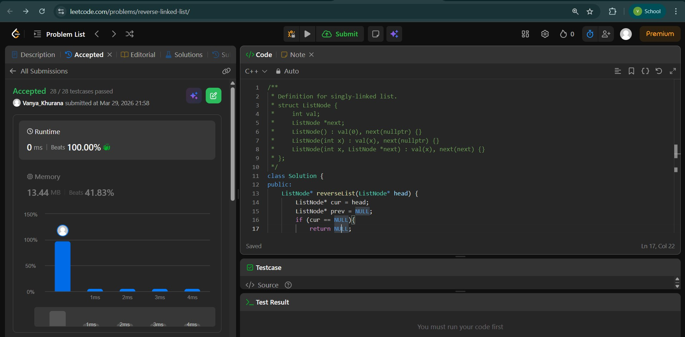
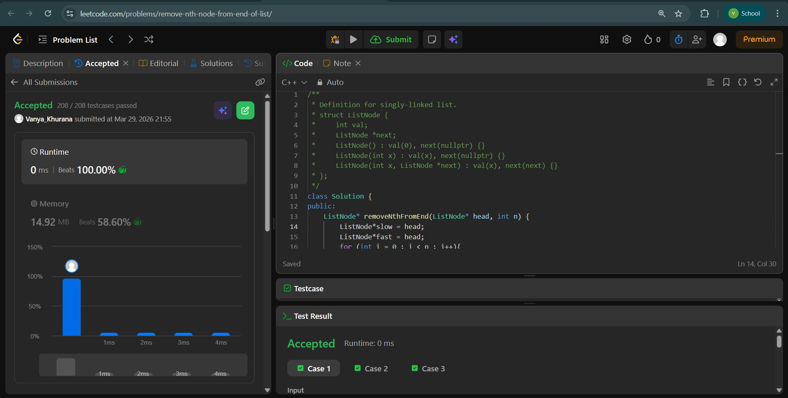
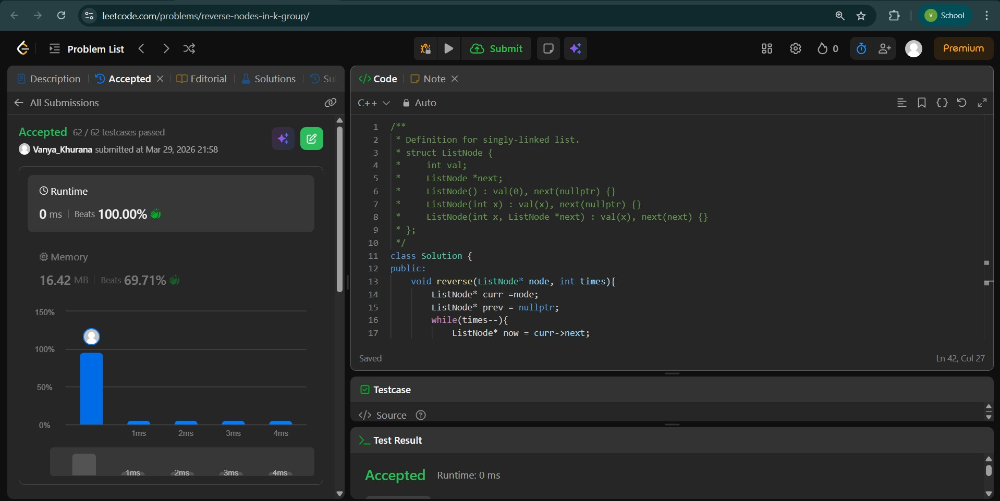

# Day - 8
## Beginner Level 


```cpp
class Solution {
public:
    ListNode* reverseList(ListNode* head) {
        ListNode* cur = head;
        ListNode* prev = NULL;
        if (cur == NULL){
            return NULL;
        }
        ListNode* temp = head->next;
        while (temp != NULL){
            cur->next = prev;
            prev = cur;
            cur = temp;
            temp = temp->next;
        }
        cur->next = prev;
        return cur;
    }
};
```

### Output


## Intermediate Level


```cpp
class Solution {
public:
    ListNode* removeNthFromEnd(ListNode* head, int n) {
        ListNode*slow = head;
        ListNode*fast = head;
        for (int i = 0 ; i < n ; i++){
            fast = fast->next;
        }
        if (fast == NULL) {
            return head->next;
        }
        while (fast->next != NULL){
            fast = fast->next;
            slow = slow->next;
        }
        slow->next = slow->next->next;
        return head;
    }
};
```

### Output


## Advanced Level


```cpp
class Solution {
public:
    void reverse(ListNode* node, int times){
        ListNode* curr =node;
        ListNode* prev = nullptr;
        while(times--){
            ListNode* now = curr->next;
            curr->next = prev;
            prev= curr;
            curr = now;
        }
        return ;
    }
    ListNode* reverseKGroup(ListNode* head, int k) {
        if(!head|| !head->next) return head;
        ListNode* left = head;
        ListNode* res = NULL;
        ListNode* prevleft = NULL;
        ListNode* right;
        while(true){
            right = left;
            for(int i=0; i< k-1; i++){
                if(!right) break;
                right = right->next;
            }
            if(right){
                ListNode* nextleft = right->next;
                reverse(left,k);
                if(prevleft) prevleft->next = right;
                prevleft = left;
                if(!res) res = right;
                left = nextleft;
            }
            else{
                if(prevleft) prevleft->next= left;
                break;
            }
        }
        return res;
    }
};
```

### Output

