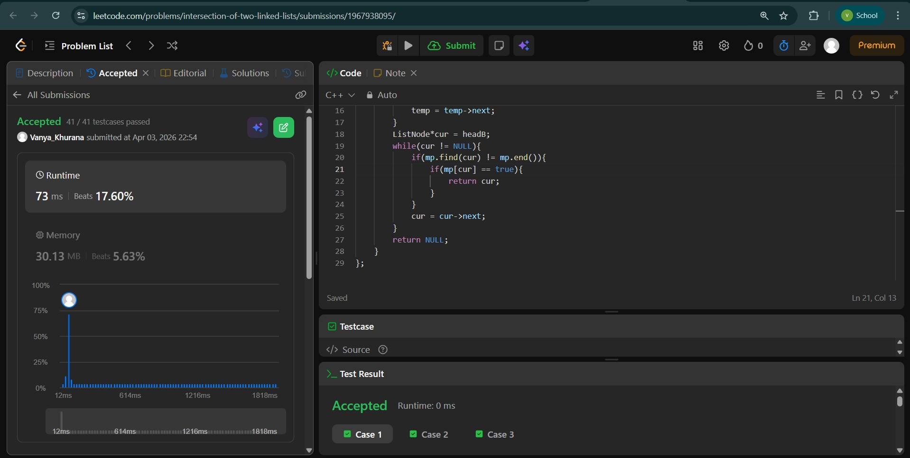
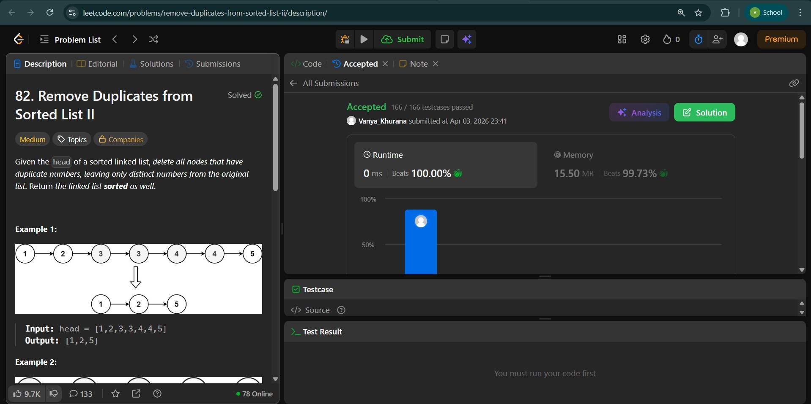
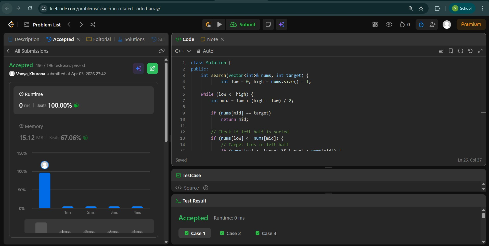

# Day - 13
## Beginner Level 


```cpp
class Solution {
public:
    ListNode *getIntersectionNode(ListNode *headA, ListNode *headB) {
        unordered_map<ListNode* , bool>mp;
        ListNode*temp = headA;
        while(temp != NULL){
            mp[temp] = true;
            temp = temp->next;
        }
        ListNode*cur = headB;
        while(cur != NULL){
            if(mp.find(cur) != mp.end()){
                if(mp[cur] == true){
                    return cur;
                }
            }
            cur = cur->next;
        }
        return NULL;
    }
};
```

### Output


## Intermediate Level


```cpp
class Solution {
public:
    ListNode* deleteDuplicates(ListNode* head) {
        ListNode *left = head;
        ListNode *right = head;
        ListNode *prev = NULL;
        int occ = 0;

        while(right!=NULL){
            while(right!=NULL && left->val == right->val){
                right = right->next;
                occ++;
            }
            if(occ == 1){
                prev = left;
                
            }
            if(occ>1){
                if(prev==NULL) head = right;
                else prev->next = right;
            }
            left = right;
            occ = 0;

        }
        return head;
    }
};
```

### Output


## Advanced Level


```cpp
class Solution {
public:
    int search(vector<int>& nums, int target) {
            int low = 0, high = nums.size() - 1;

    while (low <= high) {
        int mid = low + (high - low) / 2;

        if (nums[mid] == target)
            return mid;

        // Check if left half is sorted
        if (nums[low] <= nums[mid]) {
            // Target lies in left half
            if (nums[low] <= target && target < nums[mid]) {
                high = mid - 1;
            }
            // Otherwise go right
            else {
                low = mid + 1;
            }
        }
        // Right half is sorted
        else {
            // Target lies in right half
            if (nums[mid] < target && target <= nums[high]) {
                low = mid + 1;
            }
            // Otherwise go left
            else {
                high = mid - 1;
            }
        }
    }

    return -1;
    }
};
```

### Output

