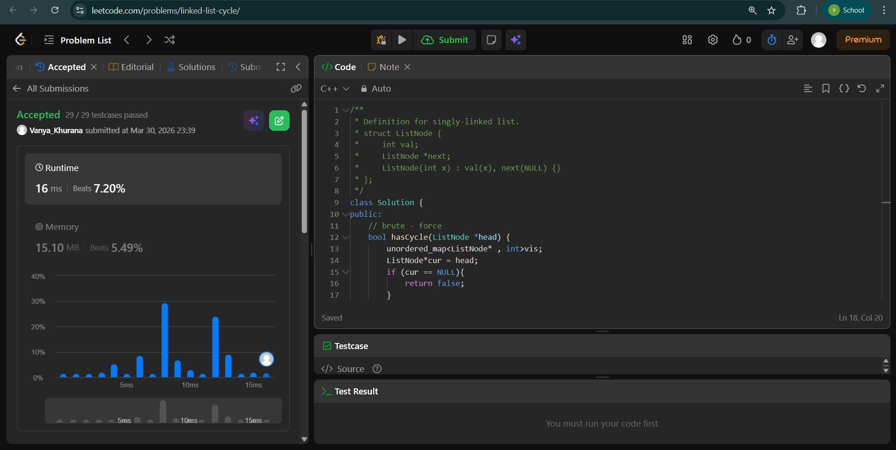
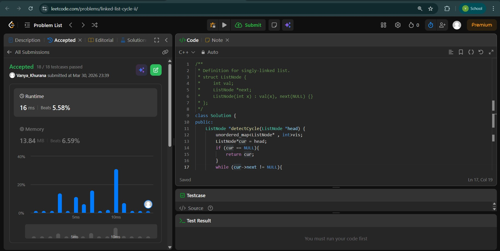
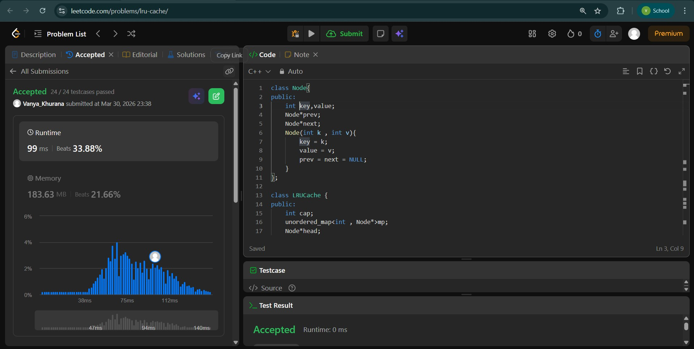

# Day - 9
## Beginner Level 


```cpp
class Solution {
public:
    // brute - force
    bool hasCycle(ListNode *head) {
        unordered_map<ListNode* , int>vis;
        ListNode*cur = head;
        if (cur == NULL){
            return false;
        }
        while (cur->next != NULL){
            if (vis.find(cur) != vis.end()){
                if(vis[cur] == 1){
                    return true;
                }
            }
            vis[cur] = 1;
            cur = cur->next;
        }
        return false;
    }
};
```

### Output


## Intermediate Level


```cpp
class Solution {
public:
    ListNode *detectCycle(ListNode *head) {
        unordered_map<ListNode* , int>vis;
        ListNode*cur = head;
        if (cur == NULL){
            return cur;
        }
        while (cur->next != NULL){
            if (vis.find(cur) != vis.end()){
                if(vis[cur] == 1){
                    return cur;
                }
            }
            vis[cur] = 1;
            cur = cur->next;
        }
        return NULL;
    }
};
```

### Output


## Advanced Level


```cpp
class Node{
public:
    int key,value;
    Node*prev;
    Node*next;
    Node(int k , int v){
        key = k;
        value = v;
        prev = next = NULL;
    }
};

class LRUCache {
public:
    int cap;
    unordered_map<int , Node*>mp;
    Node*head;
    Node*tail;
    LRUCache(int capacity) {
        cap = capacity;
        head = new Node(-1,-1);
        tail = new Node(-1,-1);
        head->next = tail;
        tail->prev = head;
    }
    void remove(Node*node){
        Node*prevnode = node->prev;
        Node*nextnode = node->next;

        prevnode->next = nextnode;
        nextnode->prev = prevnode;
    }
    void insert(Node*node){
        Node*temp = head->next;
        head->next = node;
        node->prev = head;

        node->next = temp;
        temp->prev = node;
    }
    int get(int key) {
        if (mp.find(key) == mp.end()){
            return -1;
        }
        Node*node = mp[key];
        remove(node);
        insert(node);
        return node->value;
    }
    
    void put(int key, int value) {
        if (mp.find(key) != mp.end()){
            Node*exist = mp[key];
            remove(exist);
            mp.erase(key);
        }
        if (mp.size() == cap){
            Node*lru = tail->prev;
            remove(lru);
            mp.erase(lru->key);
        }
        Node*newNode = new Node(key , value);
        insert(newNode);
        mp[key] = newNode;
    }
};
```

### Output

