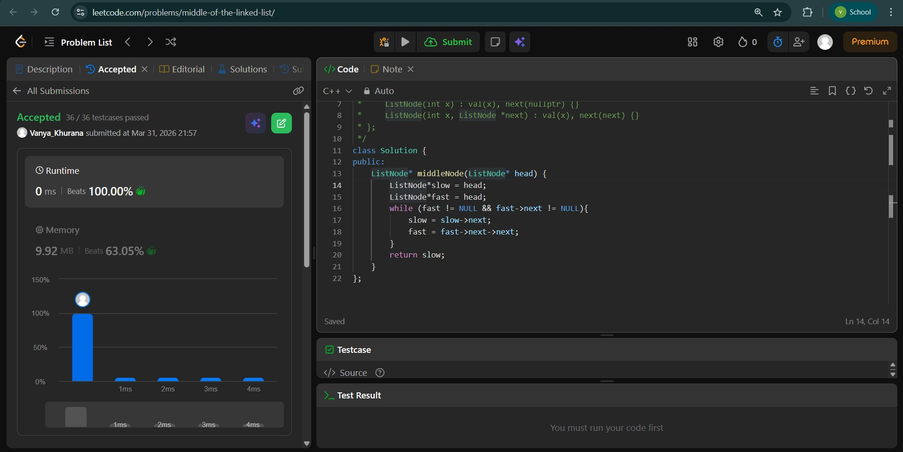
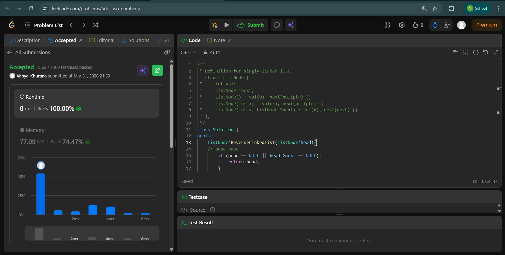
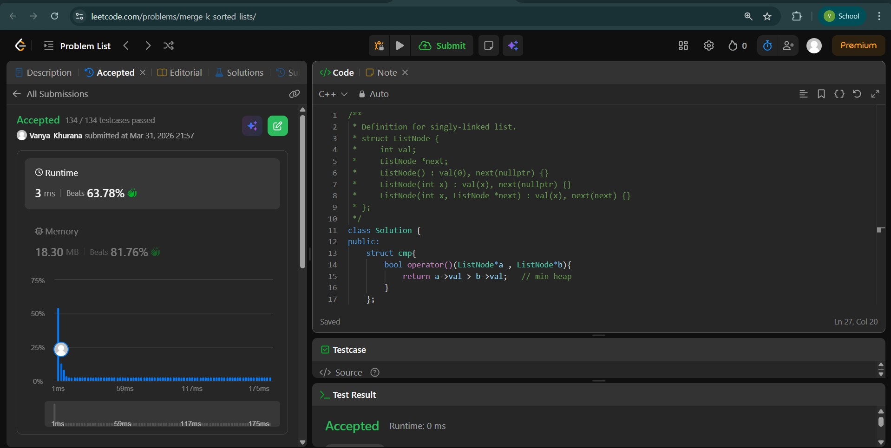

# Day - 10
## Beginner Level 


```cpp
class Solution {
public:
    ListNode* middleNode(ListNode* head) {
        ListNode*slow = head;
        ListNode*fast = head;
        while (fast != NULL && fast->next != NULL){
            slow = slow->next;
            fast = fast->next->next;
        }
        return slow;
    }
};
};
```

### Output


## Intermediate Level


```cpp
class Solution {
public:
    ListNode*ReverseLinkedList(ListNode*head){
    // base case
        if (head == NULL || head->next == NULL){
            return head;
        }
    // recursive case
        ListNode*headFromfrnd = ReverseLinkedList(head->next);
        head->next->next = head;
        head->next = NULL;
        return headFromfrnd;
    }
    ListNode* addTwoNumbers(ListNode* l1, ListNode* l2) {
        ListNode*head = NULL;
        int carry = 0;
        while (l1 != NULL or l2 != NULL or carry == 1){
            int d1 = l1 != NULL ? l1->val : 0;
            int d2 = l2 != NULL ? l2->val : 0;
            int sum = d1 + d2 + carry ;

            ListNode*n = new ListNode(sum % 10);
            n->next = head;
            head = n;

            carry = sum/10;
            l1 = l1 != NULL ? l1->next : l1;
            l2 = l2 != NULL ? l2->next : l2;
        }
        head = ReverseLinkedList(head);
        return head;
    }
};
```

### Output


## Advanced Level


```cpp
class Solution {
public:
    struct cmp{
        bool operator()(ListNode*a , ListNode*b){
            return a->val > b->val;   // min heap
        }
    };
    ListNode* mergeKLists(vector<ListNode*>& lists) {
        priority_queue<ListNode* , vector<ListNode*> , cmp>pq;
        for (auto head : lists){
            if (head){
                pq.push(head);
            }
        }
        ListNode*dummy = new ListNode(0);
        ListNode*tail = dummy;
        while(!pq.empty()){
            ListNode*temp = pq.top();
            pq.pop();
            tail->next = temp;
            tail= tail->next;
            if (temp->next != NULL){
                pq.push(temp->next);
            }
        }
        return dummy->next;
    }
};
```

### Output

