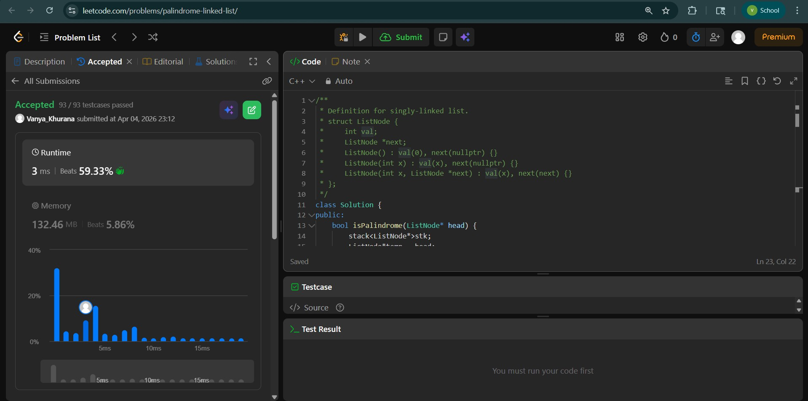
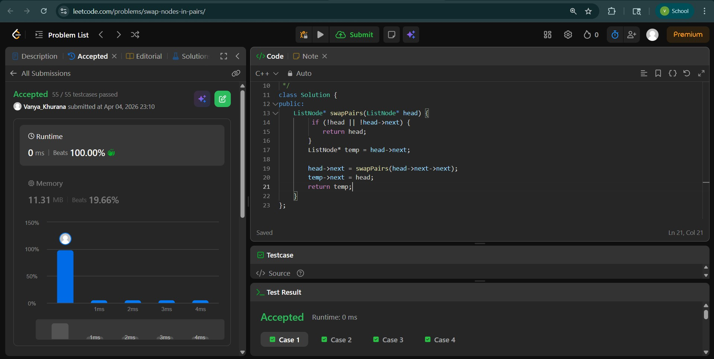
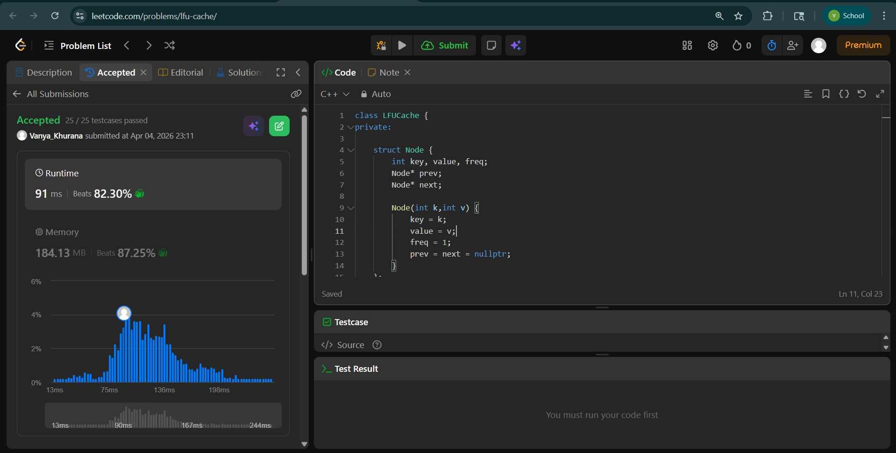

# Day - 14
## Beginner Level 


```cpp
class Solution {
public:
    bool isPalindrome(ListNode* head) {
        stack<ListNode*>stk;
        ListNode*temp = head;
        while(temp != NULL){
            stk.push(temp);
            temp = temp->next;
        }
        ListNode*cur = head;
        while (!stk.empty()){
            ListNode*top = stk.top();
            if(top->val != cur->val){
                return false;
            }
            stk.pop();
            cur = cur->next;
        }
        return true;
    }
};
```

### Output


## Intermediate Level


```cpp
class Solution {
public:
    ListNode* swapPairs(ListNode* head) {
         if (!head || !head->next) {
            return head;
        }
        ListNode* temp = head->next;

        head->next = swapPairs(head->next->next);
        temp->next = head;
        return temp;
    }
};
```

### Output


## Advanced Level


```cpp
class LFUCache {
private:

    struct Node {
        int key, value, freq;
        Node* prev;
        Node* next;

        Node(int k,int v) {
            key = k;
            value = v;
            freq = 1;
            prev = next = nullptr;
        }
    };

    struct DLL {
        Node* head;
        Node* tail;
        int size;

        DLL() {
            head = new Node(0,0);
            tail = new Node(0,0);
            head->next = tail;
            tail->prev = head;
            size = 0;
        }

        void add(Node* node) {
            node->prev = head;
            node->next = head->next;
            head->next->prev = node;
            head->next = node;
            size++;
        }

        void remove(Node* node) {
            node->prev->next = node->next;
            node->next->prev = node->prev;
            size--;
        }

        Node* removeLast() {
            if(size > 0) {
                Node* node = tail->prev;
                remove(node);
                return node;
            }
            return nullptr;
        }
    };

    unordered_map<int,Node*> keyMap;
    unordered_map<int,DLL*> freqMap;

    int capacity;
    int minFreq;

public:

    LFUCache(int capacity) {
        this->capacity = capacity;
        minFreq = 0;
    }

    int get(int key) {

        if(!keyMap.count(key)) return -1;

        Node* node = keyMap[key];
        update(node);
        return node->value;
    }

    void put(int key,int value) {

        if(capacity == 0) return;

        if(keyMap.count(key)) {
            Node* node = keyMap[key];
            node->value = value;
            update(node);
            return;
        }

        if(keyMap.size() == capacity) {
            DLL* list = freqMap[minFreq];
            Node* removed = list->removeLast();
            keyMap.erase(removed->key);
        }

        Node* node = new Node(key,value);
        keyMap[key] = node;

        minFreq = 1;

        if(!freqMap.count(1))
            freqMap[1] = new DLL();

        freqMap[1]->add(node);
    }

private:

    void update(Node* node) {

        int freq = node->freq;
        DLL* list = freqMap[freq];

        list->remove(node);

        if(freq == minFreq && list->size == 0)
            minFreq++;

        node->freq++;

        if(!freqMap.count(node->freq))
            freqMap[node->freq] = new DLL();

        freqMap[node->freq]->add(node);
    }
};
```

### Output

