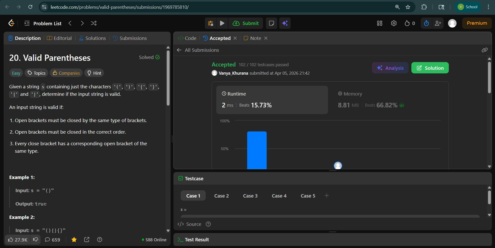
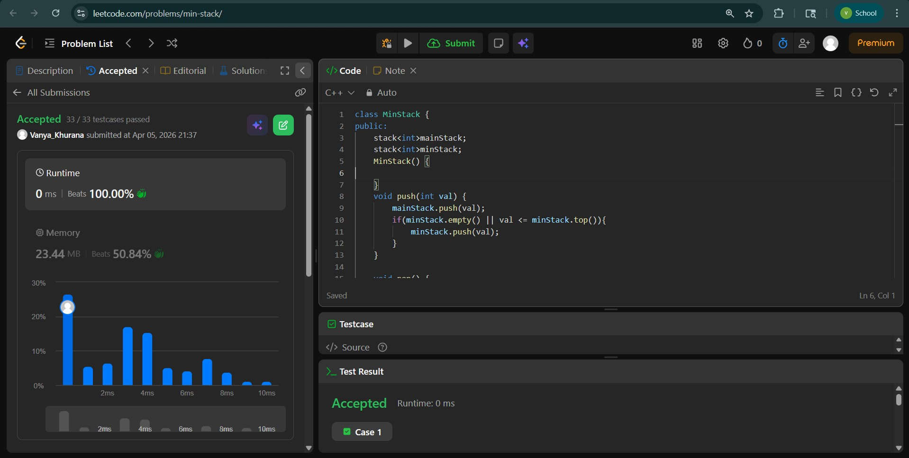
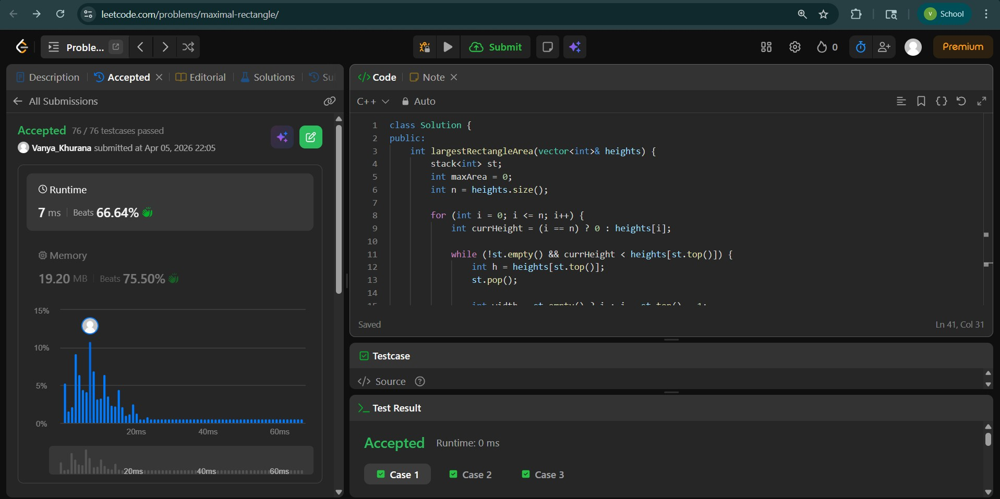

# Day - 14
## Beginner Level 


```cpp
class Solution {
public:
    bool isValid(string s) {
        stack<char>container;
        map<char , char>connectormap = {{')' , '('} , {'}','{'} , {']','['}};
        for (char letter : s){
            if (letter == '(' || letter == '{' || letter == '['){
                container.push(letter);
            }
            if (letter == ')' || letter == '}' || letter == ']'){
                if (!container.empty()){
                    if (connectormap[letter] == container.top()){
                        container.pop();
                    }
                    else{
                        container.push(letter);
                    }
                }
                else{
                    container.push(letter);
                }
            }
        }
        if (container.empty()){
            return true;
        }
        return false;
    }
};
```

### Output


## Intermediate Level


```cpp
class MinStack {
public:
    stack<int>mainStack;
    stack<int>minStack;
    MinStack() {

    }
    void push(int val) {
        mainStack.push(val);
        if(minStack.empty() || val <= minStack.top()){
            minStack.push(val);
        }
    }
    
    void pop() {
        if (mainStack.top() == minStack.top()){
            minStack.pop();
        }
        mainStack.pop();
    }
    
    int top() {
        int ans = mainStack.top();
        return ans;
    }
    
    int getMin() {
        return minStack.top();
    }
};

```

### Output


## Advanced Level


```cpp
class Solution {
public:
    int largestRectangleArea(vector<int>& heights) {
        stack<int> st;
        int maxArea = 0;
        int n = heights.size();

        for (int i = 0; i <= n; i++) {
            int currHeight = (i == n) ? 0 : heights[i];

            while (!st.empty() && currHeight < heights[st.top()]) {
                int h = heights[st.top()];
                st.pop();

                int width = st.empty() ? i : i - st.top() - 1;
                maxArea = max(maxArea, h * width);
            }
            st.push(i);
        }
        return maxArea;
    }

    int maximalRectangle(vector<vector<char>>& matrix) {
        if (matrix.empty()) return 0;

        int rows = matrix.size();
        int cols = matrix[0].size();
        vector<int> height(cols, 0);

        int maxArea = 0;

        for (int i = 0; i < rows; i++) {
            // build histogram
            for (int j = 0; j < cols; j++) {
                if (matrix[i][j] == '1')
                    height[j] += 1;
                else
                    height[j] = 0;
            }

            // solve histogram
            maxArea = max(maxArea, largestRectangleArea(height));
        }

        return maxArea;
    }
};
```

### Output

