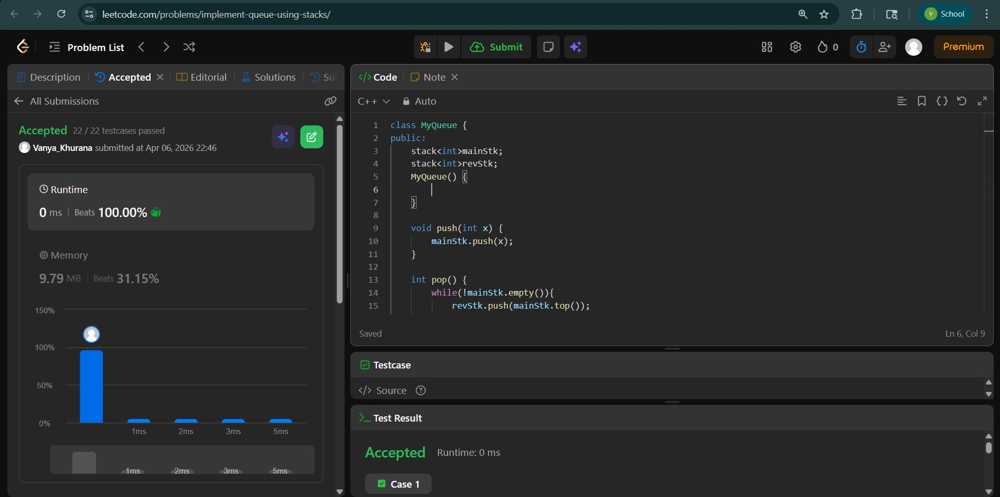
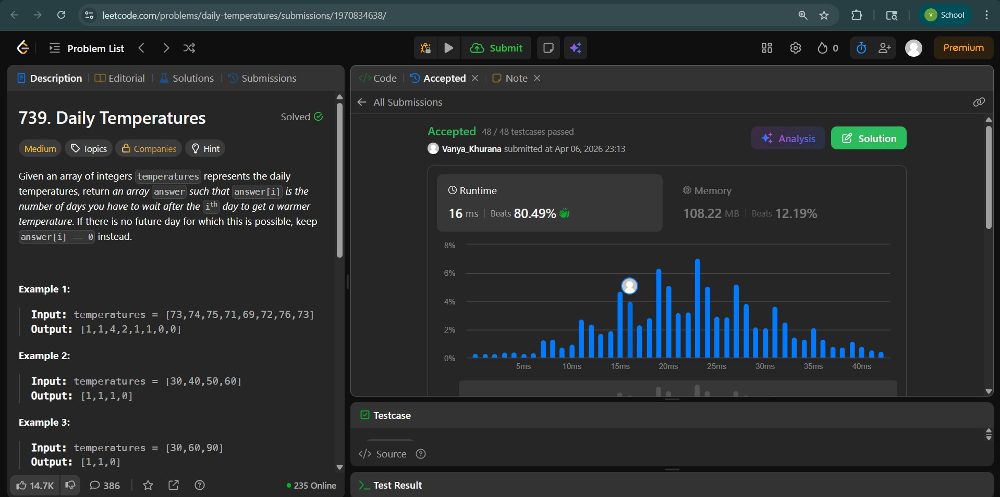
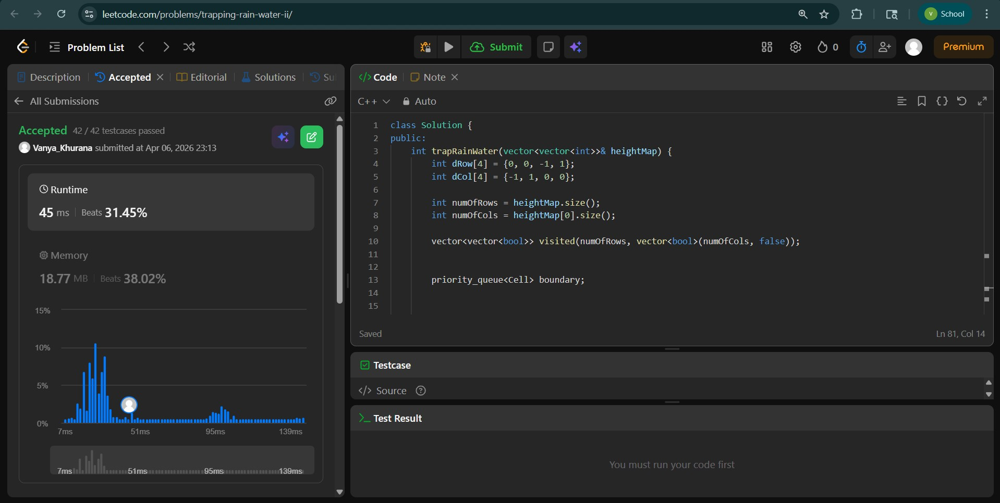

# Day - 16
## Beginner Level 


```cpp
class MyQueue {
public:
    stack<int>mainStk;
    stack<int>revStk;
    MyQueue() {
        
    }
    
    void push(int x) {
        mainStk.push(x);
    }
    
    int pop() {
        while(!mainStk.empty()){
            revStk.push(mainStk.top());
            mainStk.pop();
        }
        int ans = revStk.top();
        revStk.pop();
        while (!revStk.empty()){
            mainStk.push(revStk.top());
            revStk.pop();
        }
        return ans;
    }
    
    int peek() {
        while(!mainStk.empty()){
            revStk.push(mainStk.top());
            mainStk.pop();
        }
        int ans = revStk.top();
        while (!revStk.empty()){
            mainStk.push(revStk.top());
            revStk.pop();
        }
        return ans;
    }
    
    bool empty() {
        if (mainStk.empty()){
            return true;
        }
        return false;
    }
};

```

### Output


## Intermediate Level


```cpp
class Solution {
public:
    vector<int> dailyTemperatures(vector<int>& temperatures) {
        stack<int>s;
        vector<int>ans;
        for (int i = temperatures.size() - 1 ; i >= 0 ; i--){
            while (!s.empty() and temperatures[s.top()] <= temperatures[i]){
                s.pop();
            }
            int j;
            if (s.empty()){
                j = i;
            }
            else{
                j = s.top();
            }
            ans.push_back(j-i);
            s.push(i);
        }
        reverse(ans.begin() , ans.end());
        return ans;
    }
};
```

### Output


## Advanced Level


```cpp
class Solution {
public:
    int trapRainWater(vector<vector<int>>& heightMap) {
        int dRow[4] = {0, 0, -1, 1};
        int dCol[4] = {-1, 1, 0, 0};

        int numOfRows = heightMap.size();
        int numOfCols = heightMap[0].size();

        vector<vector<bool>> visited(numOfRows, vector<bool>(numOfCols, false));

        
        priority_queue<Cell> boundary;

        
        for (int i = 0; i < numOfRows; i++) {
            boundary.push(Cell(heightMap[i][0], i, 0));
            boundary.push(Cell(heightMap[i][numOfCols - 1], i, numOfCols - 1));
            
            visited[i][0] = visited[i][numOfCols - 1] = true;
        }

        
        for (int i = 0; i < numOfCols; i++) {
            boundary.push(Cell(heightMap[0][i], 0, i));
            boundary.push(Cell(heightMap[numOfRows - 1][i], numOfRows - 1, i));
            
            visited[0][i] = visited[numOfRows - 1][i] = true;
        }

        int totalWaterVolume = 0;

        while (!boundary.empty()) {
           
            Cell currentCell = boundary.top();
            boundary.pop();

            int currentRow = currentCell.row;
            int currentCol = currentCell.col;
            int minBoundaryHeight = currentCell.height;

         
            for (int direction = 0; direction < 4; direction++) {
                int neighborRow = currentRow + dRow[direction];
                int neighborCol = currentCol + dCol[direction];

                
                if (isValidCell(neighborRow, neighborCol, numOfRows,
                                numOfCols) &&
                    !visited[neighborRow][neighborCol]) {
                    int neighborHeight = heightMap[neighborRow][neighborCol];

                   
                    if (neighborHeight < minBoundaryHeight) {
                        totalWaterVolume += minBoundaryHeight - neighborHeight;
                    }

                    
                    boundary.push(Cell(max(neighborHeight, minBoundaryHeight),
                                       neighborRow, neighborCol));
                    visited[neighborRow][neighborCol] = true;
                }
            }
        }

        return totalWaterVolume;
    }

private:
    
    class Cell {
    public:
        int height;
        int row;
        int col;

        Cell(int height, int row, int col)
            : height(height), row(row), col(col) {}

        bool operator<(const Cell& other) const {
            return height >= other.height;
        }
    };

    bool isValidCell(int row, int col, int numOfRows, int numOfCols) {
        return row >= 0 && col >= 0 && row < numOfRows && col < numOfCols;
    }
};
```

### Output

