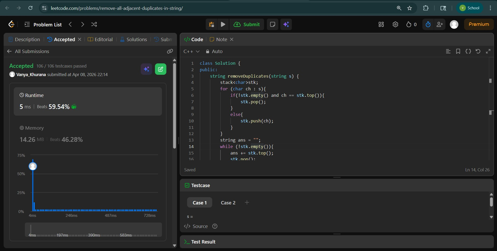
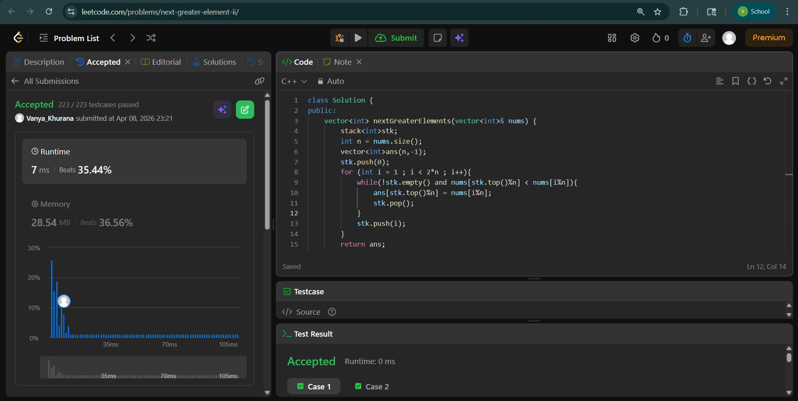
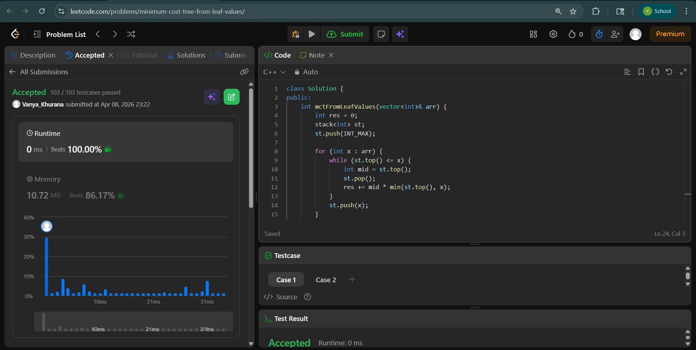

# Day - 18
## Beginner Level 


```cpp
class Solution {
public:
    string removeDuplicates(string s) {
        stack<char>stk;
        for (char ch : s){
            if(!stk.empty() and ch == stk.top()){
                stk.pop();
            }
            else{
                stk.push(ch);
            }
        }
        string ans = "";
        while (!stk.empty()){
            ans += stk.top();
            stk.pop();
        }
        reverse(ans.begin() , ans.end());
        return ans;
    }
};

```

### Output


## Intermediate Level


```cpp
class Solution {
public:
    vector<int> nextGreaterElements(vector<int>& nums) {
        stack<int>stk;
        int n = nums.size();
        vector<int>ans(n,-1);
        stk.push(0);
        for (int i = 1 ; i < 2*n ; i++){
            while(!stk.empty() and nums[stk.top()%n] < nums[i%n]){
                ans[stk.top()%n] = nums[i%n];
                stk.pop();
            }
            stk.push(i);
        }
        return ans;
    }
};
```

### Output


## Advanced Level


```cpp
class Solution {
public:
    int mctFromLeafValues(vector<int>& arr) {
        int res = 0;
        stack<int> st;
        st.push(INT_MAX);

        for (int x : arr) {
            while (st.top() <= x) {
                int mid = st.top();
                st.pop();
                res += mid * min(st.top(), x);
            }
            st.push(x);
        }

        while (st.size() > 2) {
            int top = st.top(); st.pop();
            res += top * st.top();
        }

        return res;
    }
};
```

### Output

