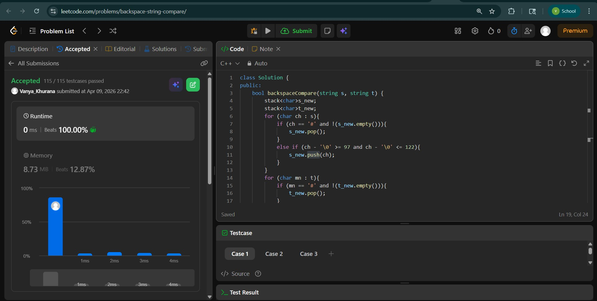
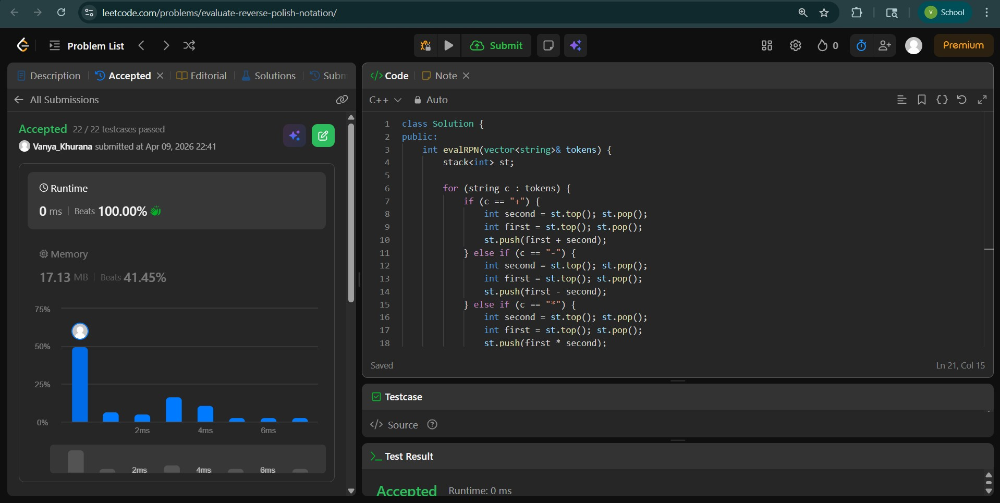
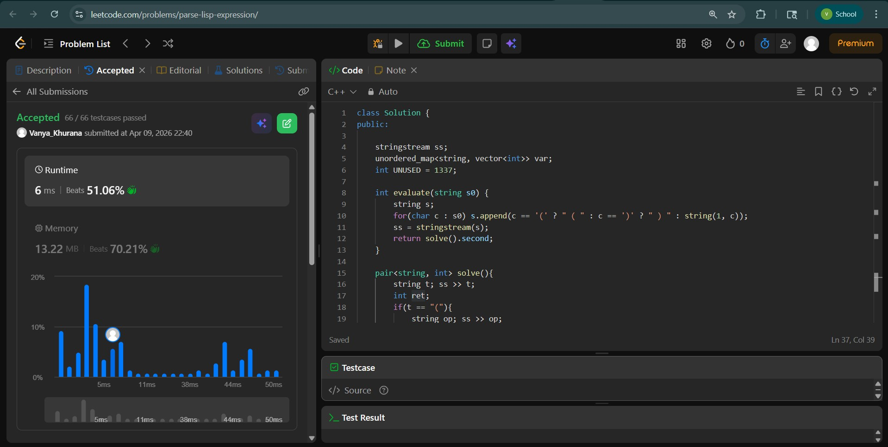

# Day - 19
## Beginner Level 


```cpp
class Solution {
public:
    bool backspaceCompare(string s, string t) {
        stack<char>s_new;
        stack<char>t_new;
        for (char ch : s){
            if (ch == '#' and !(s_new.empty())){
                s_new.pop();
            }
            else if (ch - '\0' >= 97 and ch - '\0' <= 122){
                s_new.push(ch);
            }
        }
        for (char mn : t){
            if (mn == '#' and !(t_new.empty())){
                t_new.pop();
            }
            else if (mn - '\0' >= 97 and mn - '\0' <= 122){
                t_new.push(mn);
            }
        }
        while (!s_new.empty() && !t_new.empty()) {
            if (s_new.top() != t_new.top()) {
                return false;
            }
            s_new.pop();
            t_new.pop();
        }
        return s_new.empty() && t_new.empty();
    }
};
```

### Output


## Intermediate Level


```cpp
class Solution {
public:
    int evalRPN(vector<string>& tokens) {
        stack<int> st;

        for (string c : tokens) {
            if (c == "+") {
                int second = st.top(); st.pop();
                int first = st.top(); st.pop();
                st.push(first + second);
            } else if (c == "-") {
                int second = st.top(); st.pop();
                int first = st.top(); st.pop();
                st.push(first - second);
            } else if (c == "*") {
                int second = st.top(); st.pop();
                int first = st.top(); st.pop();
                st.push(first * second);
            } else if (c == "/") {
                int second = st.top(); st.pop();
                int first = st.top(); st.pop();
                st.push(first / second);
            } else {
                st.push(stoi(c));
            }
        }

        return st.top();    
    }
};
```

### Output


## Advanced Level


```cpp
class Solution {
public:
    
    stringstream ss;
    unordered_map<string, vector<int>> var;
    int UNUSED = 1337;

    int evaluate(string s0) {
        string s;
        for(char c : s0) s.append(c == '(' ? " ( " : c == ')' ? " ) " : string(1, c)); 
        ss = stringstream(s);
        return solve().second;
    }

    pair<string, int> solve(){
        string t; ss >> t;
        int ret;
        if(t == "("){
            string op; ss >> op;
            if(op == "add" || op == "mult"){
                auto op1 = solve(), op2 = solve();
                string discard; ss >> discard;
                ret = op == "add" ? op1.second+op2.second : op1.second*op2.second;
            } else {
                vector<string> assign;
                pair<string, int> l, r;
                while(true){
                    l = solve(), r = solve(), ret = l.second;
                    if(r.first == ")") break;
                    var[l.first].push_back(r.second);
                    assign.push_back(l.first);
                }
                for(string a : assign) var[a].pop_back();
            }
        }
        else if(t == ")") ret = UNUSED;
        else if(isalpha(t.front())) ret = var[t].empty() ? UNUSED : var[t].back();
        else ret = stoi(t);
        return {t, ret};
    }   
};
```

### Output

